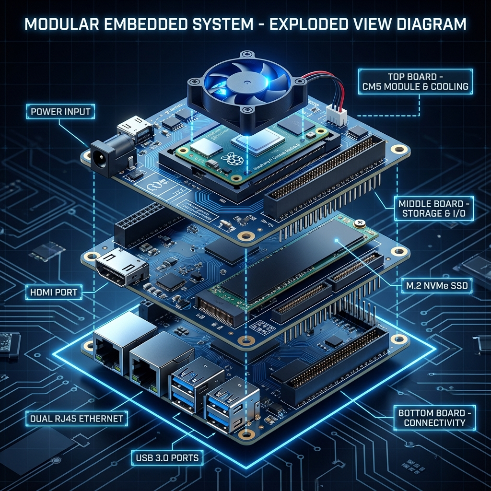
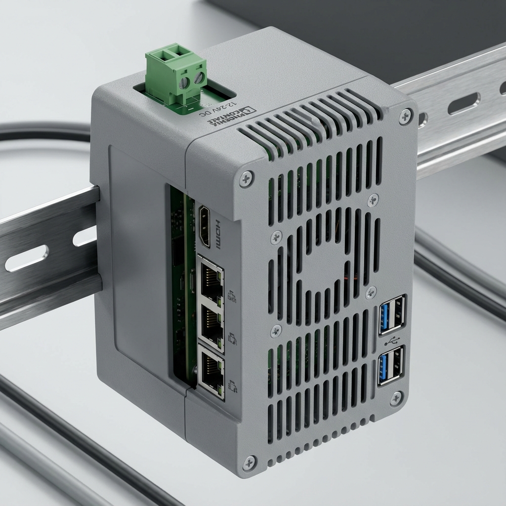

# Essensys Gateway - CM5 Edition

Welcome to the hardware design repository for the **Essensys Gateway**, a high-performance home automation hub powered by the Raspberry Pi Compute Module 5 (CM5).

## Overview

The Essensys Gateway is designed as a modular, industrial-grade solution for controlling and monitoring the Essensys home automation ecosystem. It features a unique **3-board modular stack** architecture, separating core processing, high-speed storage/media, and connectivity into distinct physical layers.

**Industrial Ready**: Designed for DIN Rail mounting with a dedicated enclosure and industrial power input.




## Architecture

The system is built as a "sandwich" of three stacked PCBs (100mm x 100mm), interconnected by high-density Mezzanine connectors:

### 1. Top Board: Core & Processing
The brain of the operation.
- **Compute Module**: Raspberry Pi CM5 (Quad-core ARM Cortex-A76).
- **Cooling**: Dedicated active cooling fan with PWM control.
- **Power**: 2-Pin Terminal Block (Bornier) for 12V-24V DC Input.

### 2. Middle Board: Storage & Media
Dedicated layer for high-speed extensions.
- **Storage**: M.2 M-Key slot for NVMe SSDs (PCIe Gen 2 x1).
- **Video**: Full-size HDMI output for local display or debugging.

### 3. Bottom Board: Connectivity
High-density IO for network integration.
- **Ethernet**: 
  - 1x Gigabit Ethernet (Native CM5).
  - 1x Gigabit Ethernet (via USB 3.0 Bridge).
- **USB**: 3x USB 3.0 Type-A ports for peripherals (Z-Wave/Zigbee sticks, etc.).

## Specifications

| Feature | Specification |
| :--- | :--- |
| **Processor** | Raspberry Pi Compute Module 5 |
| **RAM** | Up to 8GB LPDDR4X (depending on CM5 variant) |
| **Storage** | M.2 NVMe SSD (2230/2242/2280 supported via Mid Board) |
| **Network** | Dual Gigabit Ethernet (1x Native, 1x RTL8153) |
| **USB** | 3x USB 3.0 (via VL817 Hub) |
| **Video** | 1x HDMI 2.0 (4Kp60 supported) |
| **Power** | 12V-24V DC Industrial Input (Terminal Block) |
| **Dimensions** | 100mm x 100mm x 45mm (DIN Rail Mountable) |

## Repository Structure

- `src/cm5/`: KiCad Design Files
  - `CM5_Stack_Top/`: Top board design (CM5 + Fan).
  - `CM5_Stack_Mid/`: Middle board design (M.2 + HDMI).
  - `CM5_Stack_Bot/`: Bottom board design (Dual Eth + USB Hub).
- `docs/`: **Documentation MkDocs** (miroir structure [essensys-raspberry-install](https://github.com/essensys-hub/essensys-raspberry-install), adaptée Gateway CM5)
- `nix/`: Configuration NixOS (branche `nixos`)
- `scripts/`: Tests WAN HTTPS, utilitaires déploiement

## Documentation

Site en ligne : [essensys-hub.github.io/essensys-raspberry-gateway](https://essensys-hub.github.io/essensys-raspberry-gateway/)

```bash
pip install mkdocs-material mkdocs-minify-plugin mkdocs-git-revision-date-localized-plugin
mkdocs serve   # http://127.0.0.1:8000
```

## Manufacturing & Assembly

This project is designed for manufacturing services like [PCBWay](https://www.pcbway.com/).
- **PCB Stackup**: 4-Layer controlled impedance (JLC2313 or similar).
- **Assembly**: SMT assembly required for high-density connectors and BGA/QFN components (VL817, RTL8153).
- **Connectors**: Uses high-speed board-to-board mezzanine connectors for robust signal integrity of PCIe and USB 3.0 signals between layers.

---
*Designed for the Essensys Smart Home Project.*