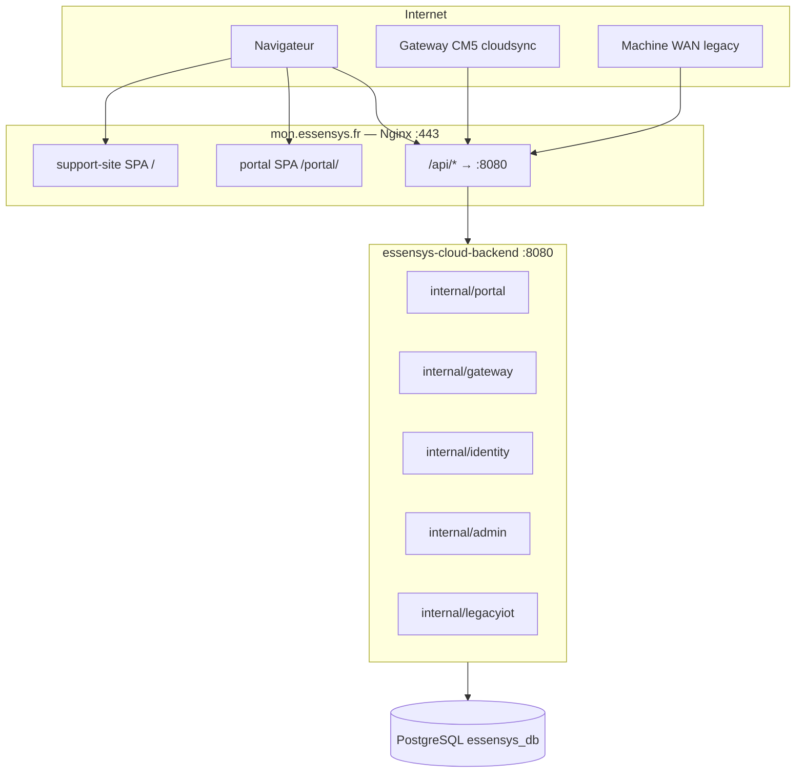

# Hub cloud unifié — consolidation backend OVH

Depuis **juin 2026**, le site `mon.essensys.fr` expose **un seul backend Go** (`essensys-cloud-backend` sur `:8080`) au lieu du dual stack legacy (`essensys-backend` + `essensys-portal-backend` :8081).

## Architecture prod (consolidée)



| Composant | Dépôt | Rôle |
|-----------|-------|------|
| Backend hub | [essensys-user-portal-backend](https://github.com/essensys-hub/essensys-user-portal-backend) | API unifiée (`CONSOLIDATED_MODE=true`) |
| Portail UI | [essensys-user-portal-frontend](https://github.com/essensys-hub/essensys-user-portal-frontend) | SPA `/portal/` |
| Support UI | [essensys-support-site](https://github.com/essensys-hub/essensys-support-site) | SPA `/` + admin |
| Déploiement | [essensys-ansible](https://github.com/essensys-hub/essensys-ansible) | Rôle `cloud_backend` |
| OpenSpec | `openspec/changes/essensys-cloud-backend-consolidation/` | Spécification et phases |

## Routes API (consolidé)

Toutes servies sur `https://mon.essensys.fr/api/…` :

| Préfixe | Module | Exemples |
|---------|--------|----------|
| `/api/portal/*` | portail distant | `inject`, `exchange`, `link-request` |
| `/api/gateway/*` | agent CM5 | `heartbeat`, `pending-actions`, `exchange` |
| `/api/auth/*` | identity | login, OAuth Google/Apple |
| `/api/admin/*` | admin | stats, users, newsletters |
| `/api/mystatus` | legacy IoT | POST telemetry WAN |
| `/api/serverinfos` | legacy IoT | GET indices collecte |

Documentation détaillée : dépôt [essensys-user-portal-backend](https://github.com/essensys-hub/essensys-user-portal-backend/tree/main/docs).

## Nginx

- **`location /api/`** → `127.0.0.1:8080` (fichier `essensys-support-site/essensys.nginx`)
- **Snippet** `/etc/nginx/snippets/essensys-portal.conf` : **uniquement** `/portal/` (assets statiques)
- **Plus de proxy** `/api/portal/` ou `/api/gateway/` vers `:8081`

En cas de 502 sur `/api/portal/*` après certbot :

```bash
ansible-playbook -i inventory cloud-nginx-only.yml
```

## Déploiement Ansible

Variables dans `essensys-ansible/group_vars/essensys/main.yml` :

```yaml
cloud_backend_consolidated: true
cloud_backend_legacy_mode: false
cloud_backend_port: 8080
cloud_backend_skip_git_clone: true   # si code rsync manuel
```

Secrets : `essensys-ansible/group_vars/essensys/vault.yml` (voir section [Secrets](#secrets-vault)).

Runbook complet : [essensys-ansible/docs/cloud-backend-migration.md](https://github.com/essensys-hub/essensys-ansible/blob/main/docs/cloud-backend-migration.md).

## Rollback dual backend

```yaml
cloud_backend_legacy_mode: true
```

Redéployer `support-site.yml` → réactive `essensys-backend` (:8080) + `essensys-portal-backend` (:8081).

## Exchange sync (CM5)

Le module `cloudsync` (`essensys-server-backend`) pousse l'état exchange vers `POST /api/gateway/exchange`. Le portail lit `GET /api/portal/exchange` avec métadonnées `stale` / `source`.

Voir [Cloud sync](../maintenance/cloud-sync.md) et [checklist E2E](../cloud-backend-consolidation-e2e.md).

## Secrets (vault)

| Fichier | Usage |
|---------|--------|
| `essensys-ansible/group_vars/essensys/vault.yml` | Secrets Ansible (JWT, DB, NR, OAuth, SMTP) — **gitignored** |
| `essensys-ansible/config/.env` | Mot de passe vault + flags NR locaux — **gitignored** |
| `essensys-ansible/config/.env.example` | Modèle sans secrets |

Ne jamais commiter `vault.yml` ni `config/.env`.

## Historique des phases OpenSpec

| Phase | Contenu | Statut |
|-------|---------|--------|
| 0–1 | Scaffold modules, gateway rules | ✅ |
| 2 | Identity (auth, profile) | ✅ |
| 3 | Admin, newsletter, audit | ✅ |
| 4 | Legacy IoT PG | ✅ |
| 5 | Exchange sync | ✅ |
| 6 | Ansible `cloud_backend` | ✅ |
| 7 | Cutover prod juin 2026 | ✅ |
| 8 | E2E armoire | En cours |

## Vérification rapide

```bash
curl -sf https://mon.essensys.fr/api/portal/health
curl -sf https://mon.essensys.fr/api/serverinfos
curl -sf -H "Authorization: Bearer $ADMIN_TOKEN" https://mon.essensys.fr/api/admin/stats
```
