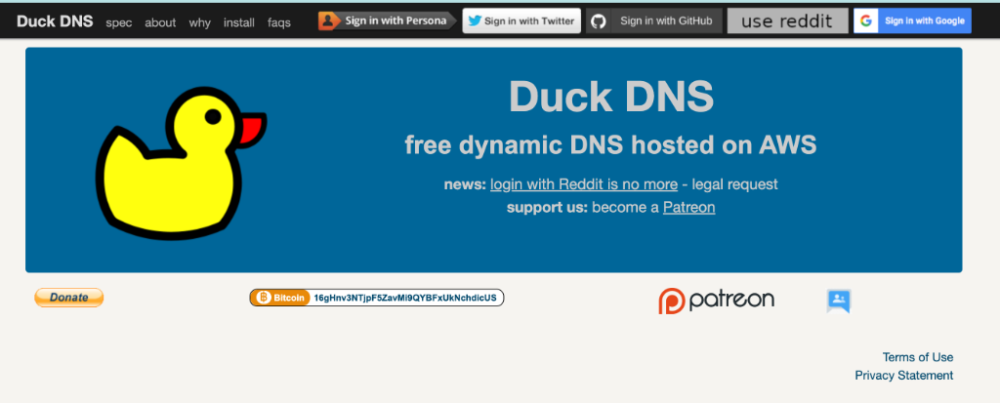
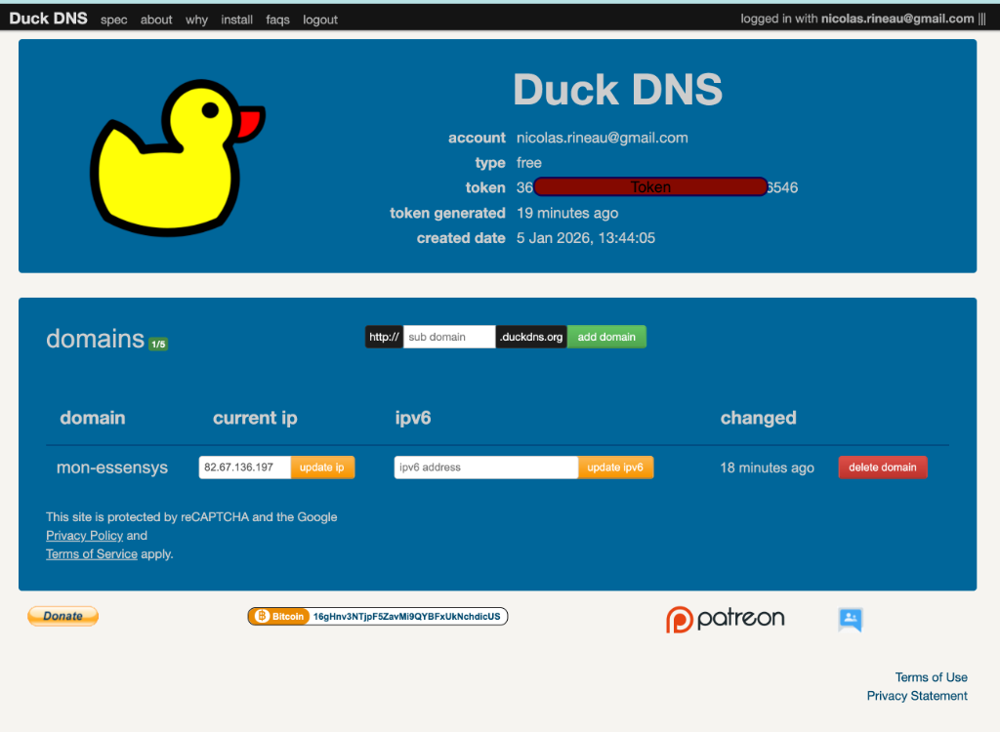

# Guide : Créer son compte et domaine DuckDNS

Ce guide vous accompagne étape par étape pour créer votre compte DuckDNS et obtenir votre nom de domaine gratuit.

## 1. Création du compte

1.  Rendez-vous sur le site **[www.duckdns.org](https://www.duckdns.org)**.
2.  En haut de la page, cliquez sur l'un des boutons de connexion (Sign in with...) :
    *   **Google** (recommandé si vous avez un compte Gmail)
    *   **GitHub**
    *   **Twitter** ou **Reddit**

*(L'interface de connexion DuckDNS)*

## 2. Récupération du Token

Une fois connecté, vous arrivez sur votre tableau de bord.

1.  Repérez la section **Account** en haut.
2.  Vous y verrez votre **Token** (une longue suite de caractères).
3.  **Copiez ce Token** (ou gardez l'onglet ouvert), vous en aurez besoin pour le script d'installation.

*(Tableau de bord DuckDNS avec Token et Domaines)*

## 3. Création du Domaine

1.  Dans la section **Domains** (au milieu de la page) :
2.  Entrez le nom de sous-domaine de votre choix dans le champ saisie (ex: `ma-maison-essensys`).
    *   Le domaine complet sera : `ma-maison-essensys.duckdns.org`
3.  Cliquez sur le bouton vert **add domain**.

*(Utilisez le champ 'sub domain' pour créer votre adresse)*

4.  Si le domaine est libre, il s'ajoute à la liste en dessous.
5.  **Notez ce nom de sous-domaine**.

## 4. IP Initiale (Optionnel)

Lors de la création, DuckDNS associe souvent votre IP publique actuelle (celle de l'ordinateur avec lequel vous naviguez).
*   Si vous êtes chez vous (sur le même réseau que le Raspberry Pi), c'est parfait.
*   Sinon, ne vous inquiétez pas : le script d'installation sur le Raspberry Pi mettra à jour cette IP automatiquement.

---

## Étape suivante

Maintenant que vous avez votre **Token** et votre **Nom de Domaine**, retournez sur le guide d'installation pour lancer le script sur votre Raspberry Pi :

[➡️ Configurer DuckDNS sur le Raspberry Pi](duckdns.md)
