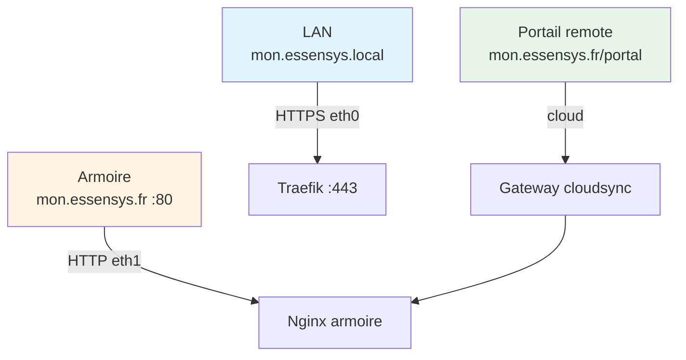

# Accès aux services

Cette section explique comment accéder aux services Essensys sur la **Gateway CM5** : LAN, WAN et **portail remote**.

## Sections

1. **[Accès local](local.md)** — `mon.essensys.local` (mDNS, HTTPS eth0)
2. **[Accès WAN](wan.md)** — DuckDNS, NAT, Traefik
3. **[Portail remote](portal-remote.md)** — `https://mon.essensys.fr/portal/` (pilotage cloud)

## Gateway dual-NIC

| Côté | Nom | Interface |
|------|-----|-----------|
| Utilisateurs LAN | `mon.essensys.local` | eth0 — Traefik :443 |
| Armoire (legacy) | `mon.essensys.fr` | eth1 — Nginx :80 (HTTP, BP_MQX_ETH) |
| Cloud distant | `mon.essensys.fr` (hub OVH) | eth0 sortant HTTPS |

