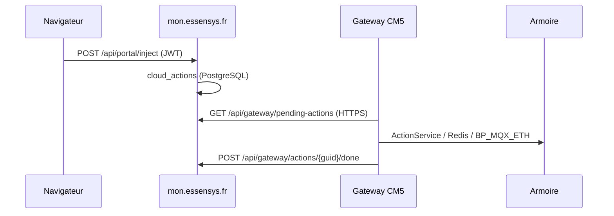

# Portail remote (mon.essensys.fr)

Pilotage domotique **à distance** via le hub cloud OVH — interface proche du frontend local, sans être sur le LAN.

## URL

- **Portail** : [https://mon.essensys.fr/portal/](https://mon.essensys.fr/portal/)
- **Support / login** : [https://mon.essensys.fr](https://mon.essensys.fr) → bouton **Portail remote**

## Prérequis

| Élément | Détail |
|---------|--------|
| Compte | Utilisateur enregistré sur mon.essensys.fr |
| Gateway | Type **essensys-gateway** (CM5) — **pas** `essensys-server` (legacy VPS) |
| Liaison | Demande approuvée par un admin + `linked_machine_id` / `linked_gateway_id` |
| Gateway en ligne | Agent **cloudsync** actif (HTTPS sortant eth0 vers OVH) |

## Parcours utilisateur

1. Se connecter sur mon.essensys.fr
2. Cliquer **Portail remote**
3. Si première visite : déposer une **demande de liaison** (n° série machine)
4. Après approbation admin : accès au tableau de bord (sécurité, chauffage, éclairage, volets…)

## Parcours administrateur

Admin → Utilisateurs :

1. Approuver la demande dans **Demandes portail domotique**
2. Assigner **gateway**, **machine cloud** et **armoire** dans le User Manager

## Fonctionnement technique

!!! note "Backend consolidé (2026)"
    Toutes les routes `/api/*` (portail, gateway, auth, admin, legacy IoT) sont servies par **`essensys-cloud-backend`** sur OVH `:8080`.  
    Doc : [Cloud backend consolidation](cloud-backend-consolidation.md).



- **Boucle ouverte** : l'UI reflète la dernière commande cloud envoyée, pas un état temps réel complet de l'armoire.
- Trafic gateway ↔ cloud : **HTTPS uniquement** (pas de HTTP WAN).

## Configuration gateway

Dans `config.yaml` du backend (`essensys-server-backend`) :

```yaml
cloud:
  enabled: true
  hub_url: "https://mon.essensys.fr"
  gateway_token: "<secret>"
  poll_interval_seconds: 30
```

Enregistrement session gateway (admin) : `POST /api/portal/admin/gateways/register` avec triplet `machine_id` + MAC eth0/eth1.

## Vérification

Script sur la gateway :

```bash
./scripts/test-wan-https-ovh.sh https://mon.essensys.fr
```

Depuis le poste :

```bash
curl -sf https://mon.essensys.fr/api/portal/health
curl -sf https://mon.essensys.fr/portal/
```

## Voir aussi

- [Cloud sync (maintenance)](../maintenance/cloud-sync.md)
- [Connectivité WAN (Ansible)](https://github.com/essensys-hub/essensys-ansible/blob/main/docs/install-gateway.md)
- OpenSpec `essensys-remote-user-interface` dans ce dépôt
