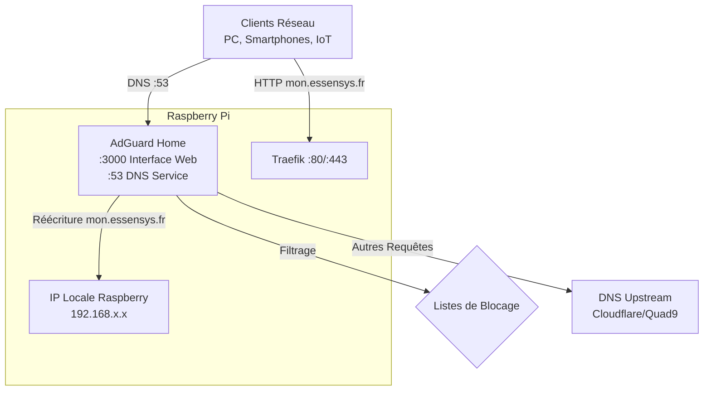

# AdGuard Home : Architecture & Configuration

AdGuard Home est le composant central pour la résolution DNS et le filtrage réseau sur l'infrastructure Essensys.

## Architecture

AdGuard Home agit comme le **Serveur DNS Récursif Local**.

*   **Rôle** : Intercepter toutes les requêtes DNS du réseau local.
*   **Fonction Clé** : Répondre avec l'IP locale du Raspberry Pi pour le domaine `mon.essensys.fr`, permettant l'accès aux services même sans internet.
*   **Upstreams** : Redirige les autres requêtes vers des DNS sécurisés (Quad9, AdGuard DNS) via HTTPS/TLS pour la confidentialité.

## Configuration

*   **Interface Web** : [http://mon.essensys.fr:3000](http://mon.essensys.fr:3000)
    *   **Login** : Défini lors de la première connexion (ou via script d'installation).
*   **DNS** : Port 53 (UDP/TCP)

### Résolution DNS Locale

La règle de réécriture est critique pour le fonctionnement hors-ligne :
*   **Domaine** : `mon.essensys.fr`
*   **Réponse** : `192.168.1.101` (Dynamique selon l'IP du Pi)

## Configuration des Routeurs

Pour que ce système soit efficace, **tous** les appareils du réseau doivent utiliser le Raspberry Pi comme serveur DNS.

**Guides détaillés :**
*   [Ubiquiti UDM Pro](../router/ubiquiti-udm-pro.md#configuration-dns-local-avec-adguard-home)
*   [Freebox](../router/freebox.md#via-linterface-freebox-dhcp)
*   [SFR Box](../router/sfr.md#via-linterface-sfr-dhcp)
*   [Orange Livebox](../router/orange-livebox.md#via-linterface-livebox)

## Maintenance

### Mise à jour
AdGuard Home gère ses propres mises à jour binaires, mais le script d'installation Essensys (`install.sh`) peut être relancé pour mettre à jour la configuration ou le service.

### Changement d'IP du Raspberry
Si l'IP du Raspberry Pi change (ex: nouveau bail DHCP), la réécriture DNS deviendra incorrecte.
**Solution** :
1.  Relancer `sudo ./install.sh` (qui mettra à jour la règle via API).
2.  OU modifier manuellement dans l'interface AdGuard : `Filtres` > `Réécritures DNS`.

### Problèmes courants
*   **Port 53 occupé** : Le script d'installation désactive `systemd-resolved` pour libérer le port 53. Si AdGuard ne démarre pas, vérifiez : `sudo lsof -i :53`.
*   **Perte de configuration** : La configuration est stockée dans `/opt/AdGuardHome/AdGuardHome.yaml`.

## Monitoring
*   **Statut** : Visible sur l'écran d'accueil du moniteur.
*   **Redémarrage** : Touche **A** dans le moniteur.

## Fichiers

*   **Binaire** : `/opt/AdGuardHome/AdGuardHome`
*   **Configuration** : `/opt/AdGuardHome/AdGuardHome.yaml`
*   **Logs** : Gérés par systemd (`journalctl -u AdGuardHome`)
