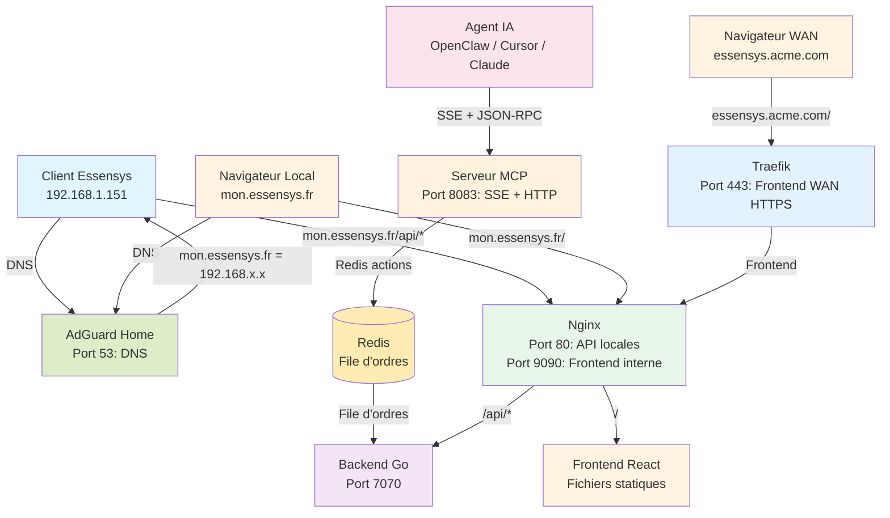
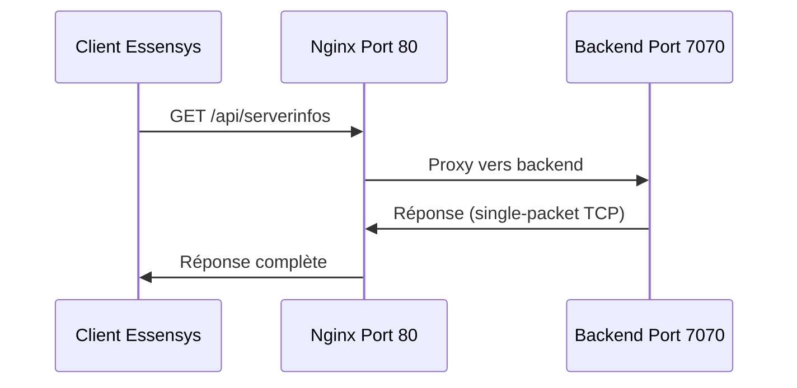
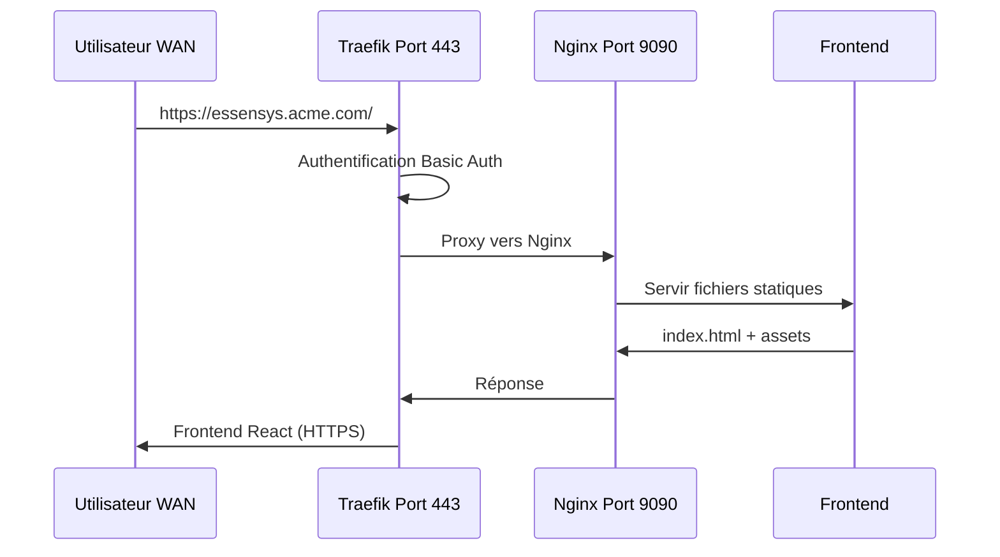
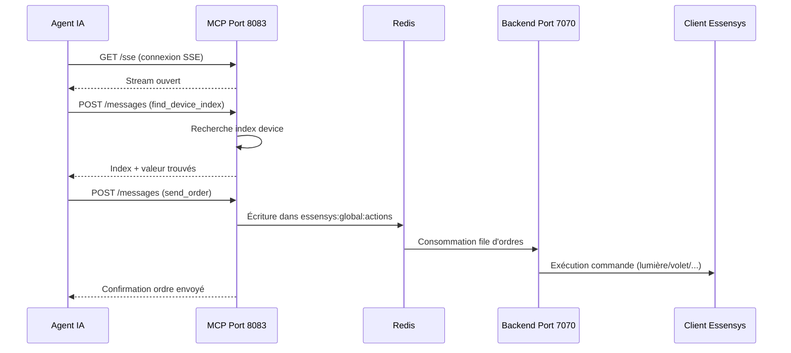

# Architecture

Vue d'ensemble de l'architecture Essensys sur Raspberry Pi.

## Composants

1. **[Backend](backend.md)** - API Go et communication avec clients legacy
2. **[Frontend](frontend.md)** - Interface web React
3. **[Nginx](nginx.md)** - Reverse proxy pour API locales
4. **[Traefik](traefik.md)** - Reverse proxy pour accès WAN
5. **[AdGuard Home](adguard.md)** - Service DNS local et filtrage
6. **[MCP](../maintenance/mcp.md)** - Serveur MCP (Model Context Protocol) pour le pilotage IA
7. **[Ports](ports.md)** - Ports utilisés par les services

## Architecture globale

## Flux de données

### Flux local (API)

### Flux WAN (Frontend)

### Flux MCP (Pilotage IA)

