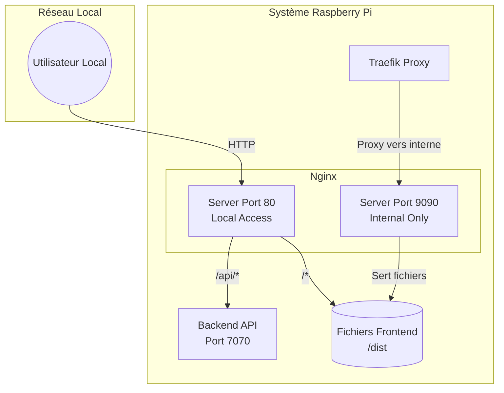

# Architecture Nginx

Nginx est le serveur web principal pour le **réseau local** et le fournisseur de fichiers statiques pour le système. Il complète Traefik en gérant tout ce qui est "interne" ou "non sécurisé" (HTTP local).

## Vue d'ensemble

Nginx remplit trois rôles distincts dans l'architecture Essensys :

1.  **Serveur Local (Port 80)** : Point d'entrée pour tous les utilisateurs sur le réseau local (`http://mon.essensys.fr`).
2.  **Reverse Proxy Local** : Redirige les appels API locaux vers le backend Go.
3.  **Serveur de Fichiers Interne (Port 9090)** : Sert les fichiers du frontend (SPA) à Traefik pour l'accès distant.



## Configuration

### 1. Accès Local (`/etc/nginx/sites-available/essensys`)

C'est la configuration principale exposée sur le port 80.

*   **Fichier** : `nginx-config/essensys.template`
*   **Fonctionnalités** :
    *   **SPA Routing** : Utilise `try_files $uri $uri/ /index.html` pour supporter le routage React.
    *   **Proxy API** : Redirige `/api/` vers `127.0.0.1:7070`.
    *   **Compatibilité Legacy** : Configuration spécifique pour les vieux clients Ethernet (voir ci-dessous).

### 2. Service Interne (`nginx-frontend-internal.conf`)

Un serveur minimaliste écoutant sur le port **9090**.

*   **But** : Servir les fichiers statiques à Traefik.
*   **Pourquoi ?** Traefik gère l'authentification et le SSL, puis a besoin de récupérer le contenu. Plutôt que de dupliquer la logique de service de fichiers dans Traefik, on utilise Nginx comme "backend de fichiers statiques".
*   **Sécurité** : Ce port n'est pas exposé à l'extérieur (firewall), il est bloqué sur localhost.

## Routage API et Compatibilité Legacy

Le système doit supporter des cartes électroniques anciennes (Client `BP_MQX_ETH`) qui ont une implémentation TCP/IP limitée.

**Problématique** : Ces clients plantent si la réponse HTTP est fragmentée en plusieurs paquets TCP ou si elle est compressée.

**Solution dans Nginx (Port 80)** :
```nginx
location /api/ {
    # 1. Désactiver la fragmentation (Bufferisation totale)
    proxy_buffering on;
    proxy_buffer_size 4k;
    proxy_buffers 8 4k;
    
    # 2. Désactiver la compression
    gzip off;
    
    # 3. Headers stricts
    proxy_set_header Connection "close";
    
    # 4. Proxy vers Go
    proxy_pass http://127.0.0.1:7070/api/;
}
```

## Logs et Diagnostic

Nginx génère des logs détaillés pour aider au débogage des clients IoT.

| Log File | Description |
|----------|-------------|
| `essensys-access.log` | Journal d'accès standard. |
| `essensys-error.log` | Erreurs Nginx (configuration, fichiers manquants). |
| `essensys-api-detailed.log` | **Critique**. Log formaté sur mesure incluant les temps de réponse backend, headers spécifiques, et tailles de paquets pour diagnostiquer les problèmes réseaux avec les cartes. |
