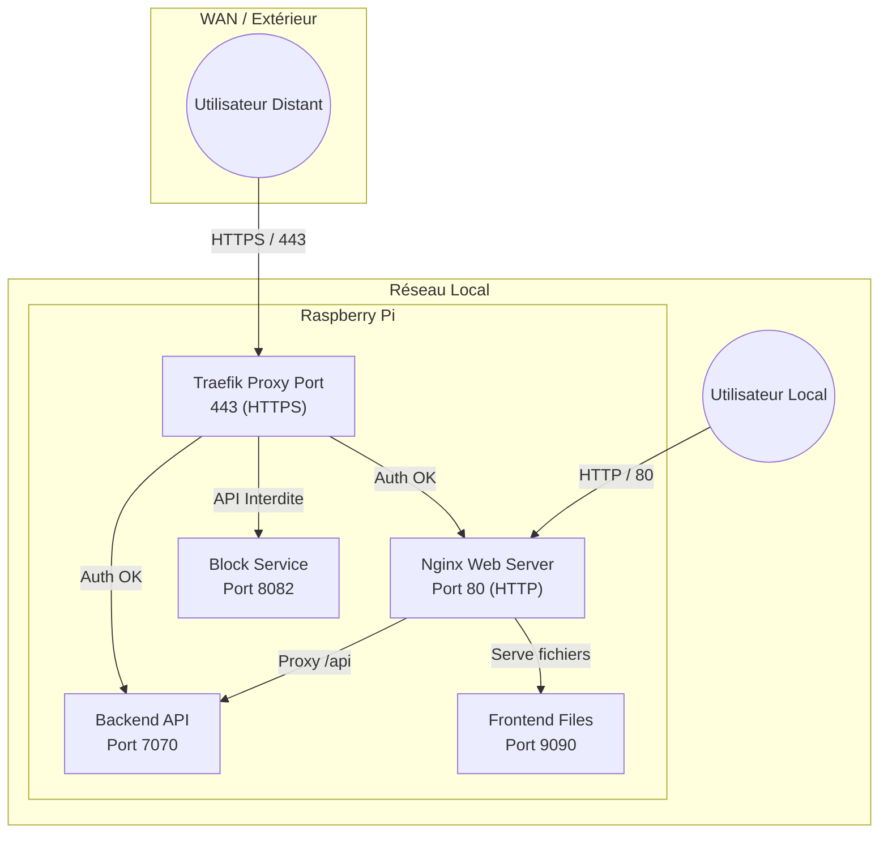
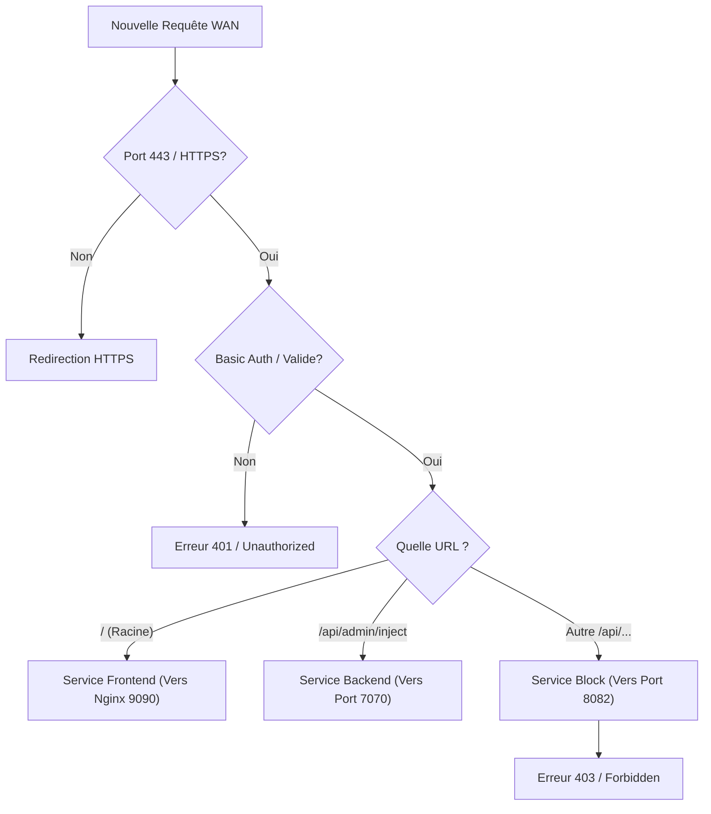

# Architecture Traefik

Traefik est le **point d'entrée unique** pour le trafic venant de l'extérieur (WAN). Il agit comme un Reverse Proxy sécurisé qui gère le chiffrement HTTPS (SSL/TLS) via Let's Encrypt et protège l'accès à l'interface d'administration et aux APIs sensibles.

## Vue d'ensemble

Le système utilise une architecture hybride pour le réseau :
- **WAN (Internet)** : Tout trafic passe par **Traefik** (Port 443).
- **LAN (Local)** : Le trafic passe directement par **Nginx** (Port 80).

## Configuration Statique (`traefik.yml`)

Le fichier `/etc/traefik/traefik.yml` définit la configuration globale du processus Traefik.

### EntryPoints (Points d'entrée)

| EntryPoint | Port | Usage | Description |
|------------|------|-------|-------------|
| `websecure` | **443** | WAN HTTPS | Point d'entrée principal pour l'accès externe. Utilise Let's Encrypt pour les certificats SSL. |
| `traefik`   | **8081** | API Interne | Utilisé uniquement pour les métriques internes et l'API de Traefik lui-même. |
| `dashboard` | **8080** | Dashboard | Interface web de Traefik pour visualiser l'état des routes. |
| `web`       | **80**  | *Désactivé* | Le port 80 est laissé libre pour Nginx qui gère le trafic HTTP local et le challenge Let's Encrypt via proxy. |

### Certificats (Let's Encrypt)
Traefik gère automatiquement le renouvellement des certificats TLS via **Let's Encrypt**.
- **Challenge** : `TLS-ALPN-01` (Validation via le port 443).
- **Stockage** : `/etc/traefik/acme.json`

## Configuration Dynamique (Routes)

La configuration des routes se trouve dans `/etc/traefik/dynamic/wan-routes.yml`. Elle définit *comment* traiter les requêtes arrivant sur le WAN.

### Middlewares (Filtres)

1.  **`redirect-to-https`** : Force tout trafic HTTP (si activé) vers HTTPS.
2.  **`auth-wan`** : Protection par **Basic Auth**.
    - fichier : `/etc/traefik/users.htpasswd`
    - Appliqué sur : Le Frontend et l'API d'injection.

### Règles de Routage (Routers)

Traefik analyse l'URL demandée et applique des règles strictes :

| Règle | URL | Action | Sécurité |
|-------|-----|--------|----------|
| `frontend-wan` | `https://domaine.fr/` | Redirige vers Nginx (Port 9090) | **Basic Auth** Requise |
| `api-inject-wan` | `.../api/admin/inject` | Redirige vers Backend (Port 7070) | **Basic Auth** Requise |
| `block-api-wan` | Autres `.../api/*` | **BLOQUÉ** (Redirige vers 8082) | Renvoie 403 Forbidden |

### Diagramme de flux de requête WAN

Voici comment Traefik décide où envoyer une requête venant d'internet :

## Différences Réseau : Local vs WAN

C'est une distinction cruciale de l'architecture Essensys sur Raspberry Pi.

### 1. Réseau Local (LAN)
- **URL** : `http://mon.essensys.fr` (ou IP locale).
- **Serveur** : **Nginx** répond directement.
- **Sécurité** : Aucune authentification requise (confiance réseau local).
- **API** : Toutes les APIs (`/api/serverinfos`, `/api/myactions`, etc.) sont accessibles.

### 2. Réseau Distant (WAN)
- **URL** : `https://[votre-id].essensys.fr`.
- **Serveur** : **Traefik** reçoit la requête.
- **Sécurité** :
    - **HTTPS obligatoire** (chiffré).
    - **Authentification Basique** (Login/Mdp) demandée par Traefik avant même d'atteindre l'application.
    - **Filtrage d'API** : Seule l'API d'injection (`/api/admin/inject`) est autorisée. Les APIs de lecture d'état (qui pourraient exposer des infos privées sans authentification forte) sont bloquées par sécurité.

## Services Internes

Traefik ne sert pas les fichiers lui-même, il passe la main à des services internes définis dans `services` :

- **`frontend-service`** : `http://127.0.0.1:9090`
    - C'est Nginx, configuré sur un port interne pour servir les fichiers statiques du dashboard (React/JS) aux requêtes validées par Traefik.
- **`backend-service`** : `http://127.0.0.1:7070`
    - C'est l'application Go principale.
- **`block-service`** : `http://127.0.0.1:8082`
    - Un petit serveur Python (`block-service.py`) dont le seul but est de répondre "403 Forbidden" rapidement.
