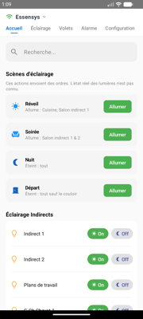
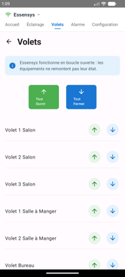
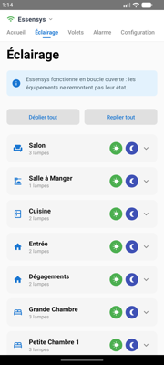
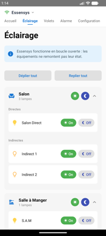
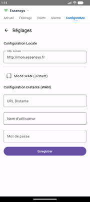

# Client Android

L'application Android officielle pour le système Essensys.

## Téléchargement

Vous pouvez télécharger la dernière version de l'application (APK) directement ici :

[:material-android: Télécharger Essensys Android v1.0.0](https://github.com/essensys-hub/essensys-android-phone-apps/raw/refs/heads/main/mon.essensys.v.1.0.0.apk){ .md-button .md-button--primary }

## Aperçu

Voici quelques captures d'écran de l'application :

### Accueil et Navigation

### Éclairage

### Volets

### Configuration

