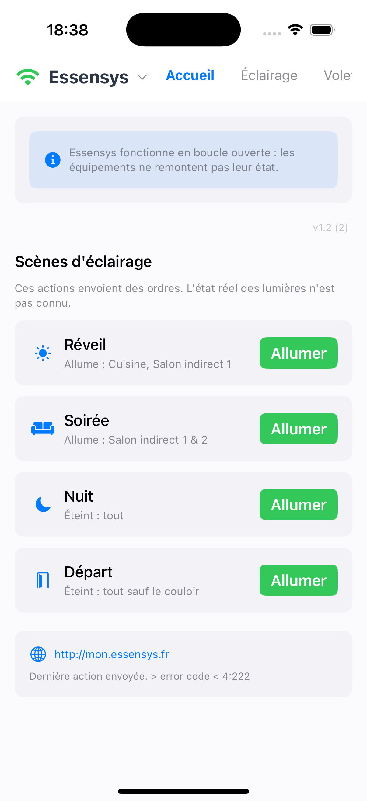
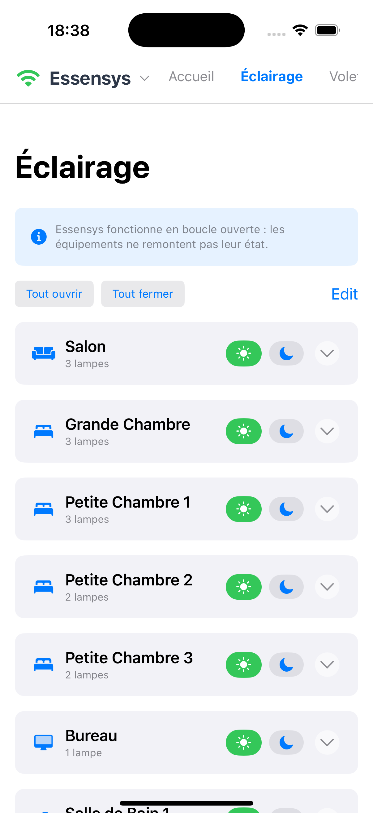
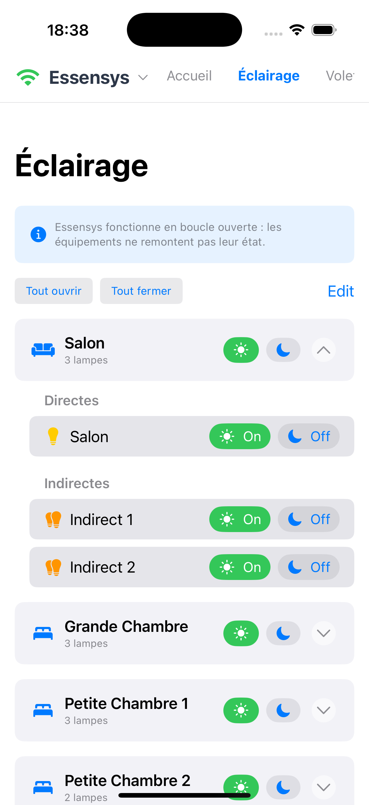
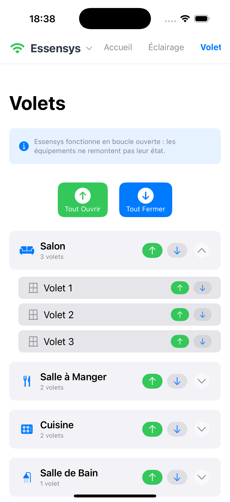
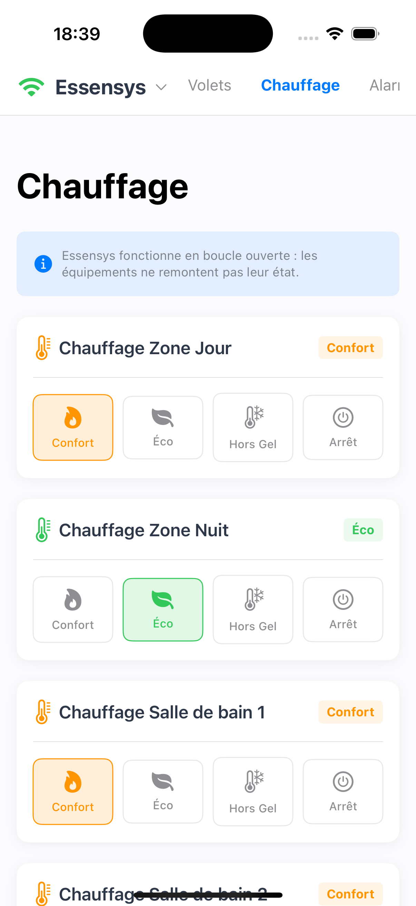
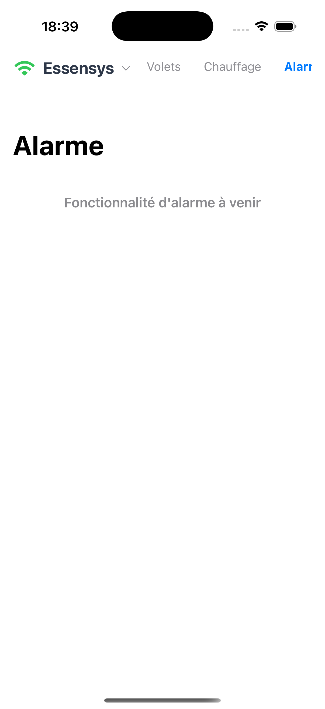
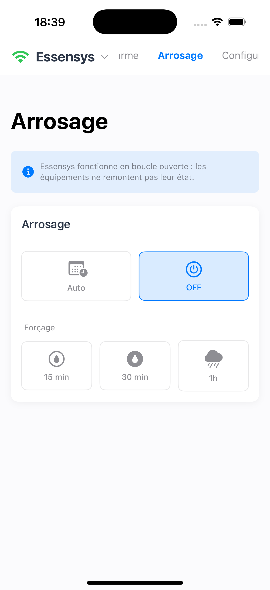
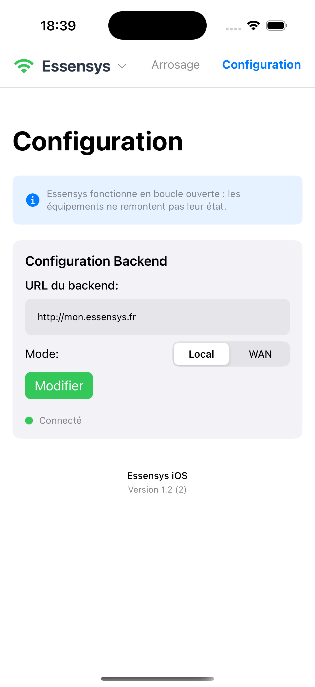

# Client iOS : Mon Essensys

L'application iPhone **Mon Essensys** est le compagnon idéal pour piloter votre installation domotique Essensys. Elle offre une interface moderne, fluide et sécurisée pour contrôler vos lumières, volets, et scènes de vie.

## Fonctionnalités Principales

*   **⚡ Contrôle instantané** de l'éclairage (pièce par pièce ou global).
*   **💡 Gestion des lampes** : Allumage/Extinction des lampes directes et indirectes.
*   **🪟 Pilotage des volets** roulants et stores.
*   **🌍 Accès à distance** (WAN) ou local (WiFi) avec bascule rapide.
*   **✏️ Personnalisation** : Renommez vos pièces et vos lampes directement dans l'app.
*   **🔒 Sécurisé** : Vos données restent locales, aucune donnée n'est envoyée sur le cloud.

## Galerie

-   
    **Tableau de Bord**  
    Accès rapide aux scènes et à la configuration.

-   
    
    **Éclairage**  
    Contrôle précis par pièce avec mode édition.

-   
    **Volets**  
    Gestion centralisée des ouvrants.

-   
    **Chauffage**  
    Gestion centralisée des chauffages.
-   
    **Alarme**  
    Gestion centralisée des alarmes.
-   
    **Arrosage**  
    Gestion centralisée des arrosages.
-   
    **Configuration**  
    Personnalisez votre application avec vos propres paramètres.

## Installation

1.  Téléchargez l'application sur l'[App Store](https://apps.apple.com/app/idXXXXXXXX).
2.  Assurez-vous que votre iPhone est connecté au même réseau WiFi que votre Raspberry Pi.
3.  Lancez l'application. Elle détectera automatiquement votre serveur Essensys si les DNS sont configurés (voir [Configuration Réseau](../connexion/configuration-reseau.md)).
4.  Si besoin, allez dans l'onglet **Réglages** pour entrer l'adresse IP de votre serveur manuellement.

## Configuration WAN (Accès Distant)

Pour contrôler votre maison depuis l'extérieur (4G/5G) :

1.  Ouvrez l'application et allez dans l'onglet **Réglages**.
2.  Activez l'option **Accès Distant (WAN)**.
3.  Entrez l'URL publique de votre serveur (ex: `https://ma-maison.dyndns.org`).
4.  Entrez votre **Nom d'utilisateur** et **Mot de passe** (définis lors de l'installation du serveur).
5.  Validez. Vous pouvez maintenant basculer entre **Local** et **Wan** via le menu en haut à gauche de l'écran d'accueil.
