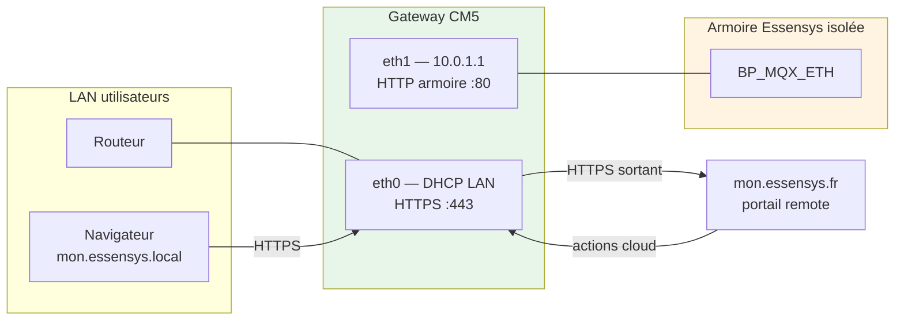

# Documentation Essensys Gateway CM5

Bienvenue dans la documentation de la **Gateway Essensys** — plateforme **Compute Module 5** à **double attache réseau** (deux ports RJ45) qui protège l'armoire Essensys tout en offrant l'accès local HTTPS et le **portail remote** cloud.

!!! info "Différence avec Raspberry Pi 4"
    L'installation **mono-interface** (Raspberry Pi 4 + un seul RJ45) est documentée dans le dépôt
    [essensys-raspberry-install](https://github.com/essensys-hub/essensys-raspberry-install).
    **Ce site** couvre exclusivement la **Gateway CM5** (eth0 LAN + eth1 armoire isolée).

## Pourquoi la Gateway ?

| Aspect | Raspberry Pi 4 (legacy) | Gateway CM5 |
|--------|-------------------------|-------------|
| Réseau | Un seul LAN | **2 RJ45** : Internet/LAN + armoire isolée |
| Sécurité | Armoire sur le même réseau | **Cloisonnement physique** — pas de route par défaut sur eth1 |
| Stockage | SSD USB | **eMMC** (OS) + **NVMe** (données) |
| Remote cloud | Limité / legacy | **Portail** `https://mon.essensys.fr/portal/` + agent HTTPS |
| Déploiement | `install.raspberrypi.yml` | `install.gateway.yml` ou **NixOS** (flake) |

## Démarrage rapide

**[Versions](versions.md)** · **[Installation Gateway CM5](installation/gateway-cm5.md)**

1. [Préparation matérielle CM5](installation/preparation-cm5.md)
2. [Installation OS Debian](installation/os-installation.md) ou [NixOS](installation/nixos-cm5.md)
3. [Déploiement Ansible](installation/essensys-installation.md) (`install.gateway.yml`)
4. [Accès local](acces/local.md) · [Portail remote](acces/portal-remote.md)

## Architecture dual-NIC

## Sections principales

### Installation
- [Gateway CM5 (dual-NIC)](installation/gateway-cm5.md) — référence complète
- [NixOS](installation/nixos-cm5.md) — variante déclarative (flake)
- [Préparation CM5](installation/preparation-cm5.md)
- [Déploiement Ansible](installation/essensys-installation.md)

### Accès
- [Local (mDNS)](acces/local.md)
- [WAN / DuckDNS](acces/wan.md)
- **[Portail remote](acces/portal-remote.md)** — pilotage à distance via le cloud

### Maintenance
- [Mise à jour](maintenance/update.md)
- [Cloud sync / portail](maintenance/cloud-sync.md)
- [Scénarios domotique](maintenance/scenarios.md)
- [Dépannage](maintenance/troubleshooting.md)

### Architecture
- [Vue d'ensemble](architecture/index.md)
- [Ports](architecture/ports.md)
- [Nginx](architecture/nginx.md) · [Traefik](architecture/traefik.md)

## Composants logiciels

- **Backend Go** (`essensys-server-backend`) — API, file d'actions, **cloudsync** vers OVH
- **Frontend React** (`essensys-server-frontend`) — interface locale
- **Portail distant** (`essensys-user-portal-*` sur `mon.essensys.fr`)
- **Nginx** — API legacy armoire (eth1, single-packet TCP)
- **Traefik** — HTTPS frontend LAN (eth0)
- **dnsmasq** — DHCP + split-DNS armoire (eth1)

## Voir aussi

- Dépôt matériel / KiCad : [README](../README.md)
- Ansible : [essensys-ansible](https://github.com/essensys-hub/essensys-ansible) — `install.gateway.yml`
- Doc Raspberry Pi 4 : [essensys-raspberry-install](https://github.com/essensys-hub/essensys-raspberry-install)
