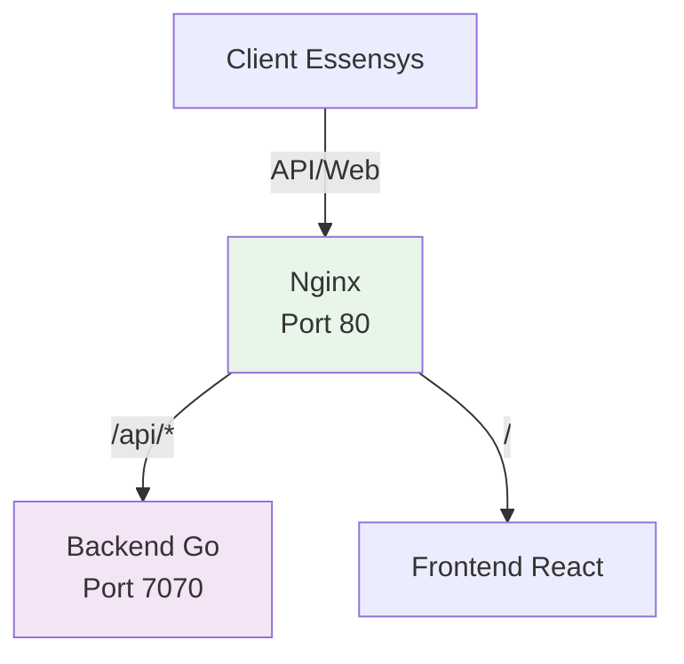

# Étape 4 : Installation d'Essensys

!!! info "Gateway CM5 (ce dépôt)"
    Sur **Gateway CM5**, utilisez **Ansible** et non `install.sh` :
    ```bash
    cd essensys-ansible
    ansible-playbook install.gateway.yml -i inventory.gateway
    ```
    Voir [Gateway CM5 (dual-NIC)](gateway-cm5.md). La section ci-dessous décrit encore le parcours **Raspberry Pi 4** historique (`install.raspberrypi.yml` / `install.sh`).

Cette section explique comment installer Essensys (backend et frontend) sur le Raspberry Pi en fonction de l'utilisateur que vous avez choisi lors de l'installation de l'OS.

## Prérequis

- [ ] Raspberry Pi OS installé et démarré.
- [ ] Connexion SSH établie.
- [ ] Accès Internet fonctionnel sur le Raspberry Pi.

---

## Méthode d'installation

Choisissez la méthode correspondant à votre nom d'utilisateur configuré à l'étape précédente.

=== "Utilisateur `essensys` (Recommandé)"

    Si vous avez respecté le nom d'utilisateur `essensys`, vous pouvez utiliser la commande rapide :

    1. **Connectez-vous en SSH** :
       ```bash
       ssh essensys@<ip-du-pi>
       ```

    2. **Lancez l'installation automatique** :
       ```bash
       sudo curl -sL https://raw.githubusercontent.com/essensys-hub/essensys-raspberry-install/refs/heads/V.1.1.0/install.sh | sudo bash
       ```

       example: 
       ```
essensys@essensys-server:~ $ sudo curl -sL https://raw.githubusercontent.com/essensys-hub/essensys-raspberry-install/refs/heads/V.1.1.0/install.sh | sudo bash
[INFO] Verification des prerequis (git, ansible)...
Hit:1 http://deb.debian.org/debian trixie InRelease
Get:2 http://deb.debian.org/debian trixie-updates InRelease [47.3 kB]                                        
Hit:3 http://archive.raspberrypi.com/debian trixie InRelease                                                 
Get:4 http://deb.debian.org/debian-security trixie-security InRelease [43.4 kB]                              
Hit:5 https://deb.nodesource.com/node_20.x nodistro InRelease                         
Fetched 90.7 kB in 0s (211 kB/s)
Reading package lists... Done
[INFO] Git deja installe
[INFO] Execution via curl | bash detectee, bootstrap du depot...
[INFO] Depot essensys-raspberry-install deja present, mise a jour...
Already up to date.
----------------------------------------
DOMAIN_FILE: /home/essensys/domain.txt
----------------------------------------
[INFO] domain.txt detecte. Saisissez le domaine WAN a utiliser.
[INFO] ref: https://essensys-hub.github.io/essensys-raspberry-install/installation/wan/
Domaine WAN (ex: mon.monwan.io):  essensys.rhinosys.io 
[INFO] Domaine enregistre dans /home/essensys/domain.txt
```
Il faut mettre le nom du DNS relier à votre adresse de votre installation WAN router.

```
[WARN] resize2fs_once introuvable, etape ignoree
[INFO] Ansible deja installe
[INFO] Depot deja present, mise a jour...
remote: Enumerating objects: 56, done.
remote: Counting objects: 100% (56/56), done.
remote: Compressing objects: 100% (39/39), done.
remote: Total 51 (delta 7), reused 51 (delta 7), pack-reused 0 (from 0)
Unpacking objects: 100% (51/51), 2.68 MiB | 13.51 MiB/s, done.
From https://github.com/essensys-hub/essensys-ansible
   95a3729..7ed78a0  V.1.0.0    -> origin/V.1.0.0
 + ed7ac00...104dde6 gh-pages   -> origin/gh-pages  (forced update)
Already on 'V.1.0.0'
Your branch is behind 'origin/V.1.0.0' by 1 commit, and can be fast-forwarded.
  (use "git pull" to update your local branch)
Updating 95a3729..7ed78a0
Fast-forward
 roles/raspberry_push_status/files/push_status.py | 4 ++--
 1 file changed, 2 insertions(+), 2 deletions(-)
[INFO] Lancement du playbook d'installation Raspberry Pi...

PLAY [Installation Essensys Raspberry Pi] *****************************************************************************************************************************************

TASK [Gathering Facts] ************************************************************************************************************************************************************
[WARNING]: Host 'localhost' is using the discovered Python interpreter at '/usr/bin/python3.13', but future installation of another Python interpreter could cause a different interpreter to be discovered. See https://docs.ansible.com/ansible-core/2.19/reference_appendices/interpreter_discovery.html for more information.
ok: [localhost]

TASK [raspberry_common : Mettre a jour le cache APT] ******************************************************************************************************************************
ok: [localhost]

TASK [raspberry_common : Installer les dependances systeme] ***********************************************************************************************************************
ok: [localhost]

TASK [raspberry_common : Definir les variables d'architecture] ********************************************************************************************************************
ok: [localhost]

TASK [raspberry_common : Verifier la presence de Go] ******************************************************************************************************************************
ok: [localhost]

TASK [raspberry_common : Telecharger Go] ******************************************************************************************************************************************
skipping: [localhost]

TASK [raspberry_common : Installer Go] ********************************************************************************************************************************************
skipping: [localhost]

TASK [raspberry_common : Ajouter Go au PATH systeme] ******************************************************************************************************************************
ok: [localhost]

TASK [raspberry_common : Telecharger le script Node.js] ***************************************************************************************************************************
ok: [localhost]

TASK [raspberry_common : Executer le script Node.js] ******************************************************************************************************************************
ok: [localhost]

TASK [raspberry_common : Installer Node.js] ***************************************************************************************************************************************
ok: [localhost]

TASK [raspberry_common : Creer l'utilisateur de service] **************************************************************************************************************************
ok: [localhost]

TASK [raspberry_common : Creer les repertoires d'installation] ********************************************************************************************************************
ok: [localhost] => (item=/opt/essensys)
changed: [localhost] => (item=/opt/essensys/backend)
changed: [localhost] => (item=/opt/essensys/frontend)
ok: [localhost] => (item=/opt/essensys/logs)

TASK [raspberry_common : Creer le repertoire de logs backend] *********************************************************************************************************************
ok: [localhost] => (item=/var/logs/Essensys)
ok: [localhost] => (item=/var/logs/Essensys/backend)

TASK [raspberry_common : S'assurer que Redis est actif] ***************************************************************************************************************************
ok: [localhost]

TASK [raspberry_backend : Definir variables backend] ******************************************************************************************************************************
ok: [localhost]

TASK [raspberry_backend : Cloner ou mettre a jour le backend] *********************************************************************************************************************
changed: [localhost]

TASK [raspberry_backend : Arreter le service backend avant mise a jour] ***********************************************************************************************************
ok: [localhost]

TASK [raspberry_backend : Copier le backend vers le repertoire d'installation] ****************************************************************************************************
changed: [localhost]

TASK [raspberry_backend : Synchroniser les dependances Go] ************************************************************************************************************************
changed: [localhost]

TASK [raspberry_backend : Telecharger les dependances Go si necessaire] ***********************************************************************************************************
skipping: [localhost]

TASK [raspberry_backend : Reexecuter go mod tidy apres download] ******************************************************************************************************************
skipping: [localhost]

TASK [raspberry_backend : Compiler le backend] ************************************************************************************************************************************
changed: [localhost]

TASK [raspberry_backend : Creer le fichier config.yaml si absent] *****************************************************************************************************************
ok: [localhost]

TASK [raspberry_backend : Forcer le port 7070 dans config.yaml] *******************************************************************************************************************
changed: [localhost]

TASK [raspberry_backend : Installer le service systemd du backend] ****************************************************************************************************************
ok: [localhost]

TASK [raspberry_backend : Recharger systemd] **************************************************************************************************************************************
ok: [localhost]

TASK [raspberry_backend : Definir les permissions du backend] *********************************************************************************************************************
changed: [localhost]

TASK [raspberry_backend : Demarrer le service backend] ****************************************************************************************************************************
changed: [localhost]

TASK [raspberry_backend : S'assurer que Redis est actif] **************************************************************************************************************************
ok: [localhost]

TASK [raspberry_frontend : Definir variables frontend] ****************************************************************************************************************************
ok: [localhost]

TASK [raspberry_frontend : Cloner ou mettre a jour le frontend] *******************************************************************************************************************
ok: [localhost]

TASK [raspberry_frontend : Copier le frontend vers le repertoire d'installation] **************************************************************************************************
changed: [localhost]

TASK [raspberry_frontend : Installer les dependances npm] *************************************************************************************************************************
changed: [localhost]

TASK [raspberry_frontend : Builder le frontend] ***********************************************************************************************************************************
changed: [localhost]

TASK [raspberry_frontend : Verifier la presence du build] *************************************************************************************************************************
ok: [localhost]

TASK [raspberry_frontend : Echouer si le build est absent] ************************************************************************************************************************
skipping: [localhost]

TASK [raspberry_frontend : Definir les permissions du frontend] *******************************************************************************************************************
ok: [localhost]

TASK [raspberry_nginx : Copier le format de log nginx] ****************************************************************************************************************************
ok: [localhost]

TASK [raspberry_nginx : Deployer la configuration nginx principale] ***************************************************************************************************************
ok: [localhost]

TASK [raspberry_nginx : Activer le site nginx] ************************************************************************************************************************************
ok: [localhost]

TASK [raspberry_nginx : Desactiver la configuration nginx par defaut] *************************************************************************************************************
ok: [localhost]

TASK [raspberry_nginx : Deployer la configuration nginx frontend interne] *********************************************************************************************************
ok: [localhost]

TASK [raspberry_nginx : Activer le site nginx frontend interne] *******************************************************************************************************************
ok: [localhost]

TASK [raspberry_nginx : Creer les fichiers de logs nginx] *************************************************************************************************************************
changed: [localhost] => (item=/var/log/nginx/essensys-api-detailed.log)
changed: [localhost] => (item=/var/log/nginx/essensys-api-trace.log)
changed: [localhost] => (item=/var/log/nginx/essensys-api-error.log)
changed: [localhost] => (item=/var/log/nginx/essensys-access.log)
changed: [localhost] => (item=/var/log/nginx/essensys-error.log)
changed: [localhost] => (item=/var/log/nginx/frontend-internal-error.log)

TASK [raspberry_nginx : Tester la configuration nginx] ****************************************************************************************************************************
ok: [localhost]

TASK [raspberry_nginx : Recharger nginx] ******************************************************************************************************************************************
changed: [localhost]

TASK [raspberry_traefik : Definir les variables Traefik] **************************************************************************************************************************
ok: [localhost]

TASK [raspberry_traefik : Verifier le binaire Traefik] ****************************************************************************************************************************
ok: [localhost]

TASK [raspberry_traefik : Lire le domaine WAN] ************************************************************************************************************************************
ok: [localhost]

TASK [raspberry_traefik : Calculer le domaine WAN] ********************************************************************************************************************************
ok: [localhost]

TASK [raspberry_traefik : Telecharger Traefik] ************************************************************************************************************************************
skipping: [localhost]

TASK [raspberry_traefik : Extraire Traefik] ***************************************************************************************************************************************
skipping: [localhost]

TASK [raspberry_traefik : Installer le binaire Traefik] ***************************************************************************************************************************
skipping: [localhost]

TASK [raspberry_traefik : Creer les repertoires Traefik] **************************************************************************************************************************
ok: [localhost] => (item=/etc/traefik)
ok: [localhost] => (item=/etc/traefik/dynamic)
ok: [localhost] => (item=/var/log/traefik)
ok: [localhost] => (item=/var/lib/traefik)

TASK [raspberry_traefik : Deployer la configuration Traefik] **********************************************************************************************************************
ok: [localhost]

TASK [raspberry_traefik : Deployer la configuration dynamique locale] *************************************************************************************************************
ok: [localhost]

TASK [raspberry_traefik : Deployer la configuration dynamique WAN] ****************************************************************************************************************
ok: [localhost]

TASK [raspberry_traefik : Creer acme.json] ****************************************************************************************************************************************
changed: [localhost]

TASK [raspberry_traefik : Creer users.htpasswd] ***********************************************************************************************************************************
changed: [localhost]

TASK [raspberry_traefik : Installer le service de blocage Traefik] ****************************************************************************************************************
ok: [localhost]

TASK [raspberry_traefik : Installer generate-htpasswd.sh] *************************************************************************************************************************
ok: [localhost]

TASK [raspberry_traefik : Installer le service systemd Traefik block] *************************************************************************************************************
ok: [localhost]

TASK [raspberry_traefik : Installer le service systemd Traefik] *******************************************************************************************************************
ok: [localhost]

TASK [raspberry_traefik : Recharger systemd] **************************************************************************************************************************************
ok: [localhost]

TASK [raspberry_traefik : Activer et demarrer Traefik] ****************************************************************************************************************************
changed: [localhost]

TASK [raspberry_traefik : Activer et demarrer le service de blocage] **************************************************************************************************************
changed: [localhost]

TASK [raspberry_adguard : Definir l'architecture AdGuard] *************************************************************************************************************************
ok: [localhost]

TASK [raspberry_adguard : Verifier resolved.conf] *********************************************************************************************************************************
ok: [localhost]

TASK [raspberry_adguard : Desactiver DNSStubListener pour systemd-resolved] *******************************************************************************************************
skipping: [localhost]

TASK [raspberry_adguard : Verifier resolv.conf source] ****************************************************************************************************************************
ok: [localhost]

TASK [raspberry_adguard : Verifier resolv.conf] ***********************************************************************************************************************************
skipping: [localhost]

TASK [raspberry_adguard : Installer AdGuard Home] *********************************************************************************************************************************
skipping: [localhost]

TASK [raspberry_adguard : Deployer la configuration AdGuard Home] *****************************************************************************************************************
ok: [localhost]

TASK [raspberry_adguard : Installer le service AdGuard Home] **********************************************************************************************************************
ok: [localhost]

TASK [raspberry_adguard : Demarrer AdGuard Home] **********************************************************************************************************************************
changed: [localhost]

TASK [raspberry_adguard : Attendre l'API AdGuard] *********************************************************************************************************************************
ok: [localhost]

TASK [raspberry_adguard : Configurer le rewrite DNS pour mon.essensys.fr] *********************************************************************************************************
ok: [localhost]

TASK [raspberry_monitor : Copier le script de monitoring] *************************************************************************************************************************
ok: [localhost]

TASK [raspberry_monitor : Copier le setup du monitoring] **************************************************************************************************************************
ok: [localhost]

TASK [raspberry_monitor : Executer le setup du monitoring] ************************************************************************************************************************
changed: [localhost]

TASK [raspberry_logrotate : Installer la configuration logrotate] *****************************************************************************************************************
ok: [localhost]

TASK [raspberry_push_status : Copier le script de push status] ********************************************************************************************************************
changed: [localhost]

TASK [raspberry_push_status : Installer le service systemd de push status] ********************************************************************************************************
ok: [localhost]

TASK [raspberry_push_status : Installer le timer systemd de push status] **********************************************************************************************************
ok: [localhost]

TASK [raspberry_push_status : Recharger systemd] **********************************************************************************************************************************
ok: [localhost]

TASK [raspberry_push_status : Activer le timer push status] ***********************************************************************************************************************
ok: [localhost]

PLAY RECAP ************************************************************************************************************************************************************************
localhost                  : ok=76   changed=20   unreachable=0    failed=0    skipped=11   rescued=0    ignored=0   
[INFO] Configuration du mot de passe WAN (admin)...
Mot de passe: 
Note : saisissez le mot de passe utilise pour la connexion WAN.
[INFO] Generation du fichier htpasswd...
[WARN] Le fichier existe deja. Ajout de l'utilisateur...
[INFO] Fichier htpasswd cree avec succes: /etc/traefik/users.htpasswd
[INFO] Utilisateur: admin
[INFO] 
[INFO] Pour ajouter d'autres utilisateurs, executez a nouveau ce script
[INFO] Termine. Installation lancee via Ansible.
essensys@essensys-server:~ $ 


=== "Autre utilisateur (Personnalisé)"

    Si vous utilisez un nom d'utilisateur différent (ex: `pi`, `admin`), vous devez cloner le projet manuellement :

    1. **Connectez-vous en SSH** :
       ```bash
       ssh <votre-user>@<ip-du-pi>
       ```

    2. **Clonez le dépôt** :
       ```bash
       git clone https://github.com/essensys-hub/essensys-raspberry-install
       cd essensys-raspberry-install
       ```

    3. **Lancez l'installation avec votre utilisateur** :
       ```bash
       chmod +x install.sh
       sudo ./install.sh --user <votre-user>
       ```

---

## Options du script (Optionnel)

Le script `install.sh` accepte des arguments pour des configurations spécifiques :

| Option | Description |
| :--- | :--- |
| `--staging` | Active l'environnement de test (staging) pour Let's Encrypt. |
| `--user <username>` | Définit l'utilisateur cible (obligatoire si différent de `essensys`). |

## Architecture installée



---

!!! warning "L'adresse IP `192.168.1.151` utilisée dans cet exemple est fictive"
    Vous devez impérativement identifier l'adresse IP réelle de votre "essensys client" sur votre réseau local pour configurer les redirections de port correctement.

!!! success "Installation Terminée !"
    Félicitations ! Votre serveur Essensys est maintenant opérationnel.
    
    [:material-lan: **Configurer le réseau**](../connexion/configuration-reseau.md){ .md-button .md-button--primary }

## Dépannage

### Vérifier les services
```bash
sudo systemctl status essensys-backend
sudo systemctl status essensys-frontend
sudo systemctl status nginx
```


