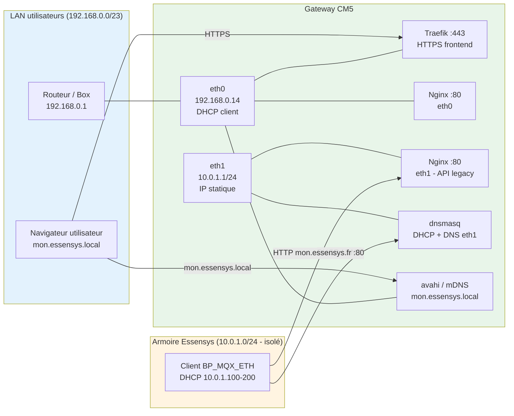

# Installation Gateway CM5 (double attache réseau)

La **Gateway Essensys** est la nouvelle plateforme matérielle bâtie autour d'un
**Raspberry Pi Compute Module 5 (CM5)**. Elle apporte un **niveau de sécurité
supérieur** par rapport à l'installation Raspberry Pi 4 mono-interface : le trafic
**utilisateur** et le trafic **armoire Essensys** sont **physiquement séparés** sur
**deux ports Ethernet (RJ45)** distincts.

!!! info "À qui s'adresse cette page"
    Cette page décrit l'installation **double attache réseau** (« dual-NIC »), le
    profil recommandé pour les déploiements en production. Pour l'installation
    historique mono-interface sur Raspberry Pi 4, voir
    [Installation standard](index.md). Pour la variante **NixOS**, voir
    [Préparation NixOS — Gateway CM5](nixos-cm5.md).

---

## 1. Principe : deux ports RJ45, deux réseaux

| Port | Réseau | Rôle | Exemple réel |
|------|--------|------|--------------|
| **eth0** (natif CM5) | **LAN / utilisateurs** | Accès au frontend en **HTTPS** (Traefik :443), administration, mises à jour, SSH. Client **DHCP** du routeur amont. | `192.168.0.14/23` |
| **eth1** (USB RTL8153) | **Armoire Essensys** | Réseau **privé isolé** dédié au bus d'équipements. La gateway y est **serveur DHCP + DNS** et y expose l'**API legacy en HTTP** (Nginx :80, compatibilité `BP_MQX_ETH`). **IP statique, sans route par défaut.** | `10.0.1.1/24` |

L'intérêt de sécurité est double :

- **Cloisonnement** : l'armoire et ses équipements ne sont **jamais exposés** sur le
  LAN utilisateur ni sur Internet. Le segment `eth1` n'a **pas de route par défaut**.
- **Surface réduite** : seul `eth0` porte le frontend HTTPS et l'accès distant ;
  l'armoire ne voit que ce dont le firmware a besoin (HTTP :80 + DHCP/DNS).



---

## 2. Résolution de nom : deux domaines, une seule gateway

La gateway répond sous **deux noms** selon le côté du réseau :

| Côté | Nom | Résolution | Mécanisme |
|------|-----|------------|-----------|
| **LAN utilisateurs (eth0)** | `mon.essensys.local` | → `192.168.0.14` (IP eth0) | **mDNS** via `avahi-publish` (aucune config DNS côté client) |
| **Armoire (eth1)** | `mon.essensys.fr` | → `10.0.1.1` (IP eth1) | **split-DNS** `dnsmasq` (`address=/mon.essensys.fr/10.0.1.1`) |

!!! note "Pourquoi deux noms ?"
    Le firmware historique de l'armoire (`BP_MQX_ETH`) interroge `mon.essensys.fr`
    en HTTP : sur le segment armoire, ce nom **doit** pointer vers la gateway
    (`10.0.1.1`). Côté utilisateurs, `mon.essensys.local` est diffusé en mDNS,
    ce qui évite toute configuration DNS sur les postes du LAN.

---

## 3. Matériel et stockage (eMMC + NVMe)

La CM5 sépare aussi le **stockage** pour préserver l'eMMC de l'usure :

| Support | Périphérique | Contenu |
|---------|--------------|---------|
| **eMMC interne** | `mmcblk0` (~29 Go) | OS (Debian 13 « trixie »), paquets, images de conteneurs, configuration statique, bootloader. |
| **NVMe SSD** | `nvme0n1` → `/mnt/nvme` (label `essensys-data`) | Données « vivantes » à forte écriture : `/mnt/nvme/data` (`data_dir`), `/mnt/nvme/logs`, bases Redis, TSDB Prometheus, journaux applicatifs. |

Vérification rapide sur la gateway :

```bash
lsblk -o NAME,SIZE,TYPE,MOUNTPOINT,LABEL
# mmcblk0  29.1G ... /                rootfs
# nvme0n1 119.2G ... /mnt/nvme        essensys-data
findmnt /mnt/nvme
```

!!! warning "Pré-requis firmware CM5"
    Le **NVMe (PCIe)** doit être activé dans l'EEPROM de la CM5 et le `BOOT_ORDER`
    adapté. Cette étape n'est pas automatisable et doit être réalisée au premier
    flash — voir la documentation Raspberry Pi officielle pour CM5 + NVMe.

---

## 4. Configuration réseau réelle (référence)

Les fichiers ci-dessous sont générés par le rôle Ansible
`raspberry_gateway_network` et reproduits ici pour référence.

### eth0 — LAN (`/etc/systemd/network/10-eth0.network`)

```ini
[Match]
MACAddress=88:a2:9e:34:27:61   # MAC réelle de eth0
Name=eth0

[Network]
DHCP=ipv4
IPv6AcceptRA=no
LinkLocalAddressing=no

[DHCP]
RouteMetric=10
UseDNS=false
UseDomains=false
```

### eth1 — Armoire (`/etc/systemd/network/20-eth1.network`)

```ini
[Match]
MACAddress=00:e0:4c:68:01:be   # MAC réelle de eth1 (USB RTL8153)
Name=eth1

[Network]
Address=10.0.1.1/24
IPv6AcceptRA=no
LinkLocalAddressing=no
ConfigureWithoutCarrier=yes
# Pas de route par defaut sur eth1 -> isolement du segment armoire
```

!!! tip "Nommage stable des interfaces"
    Les interfaces sont appariées **par adresse MAC** (`Match`), ce qui garantit
    que `eth0`/`eth1` ne s'inversent jamais entre deux redémarrages. Relevez vos
    MAC réelles avec `ip link show` avant de remplir l'inventaire.

### DHCP + DNS armoire (`/etc/dnsmasq.conf`)

```ini
interface=eth1
bind-interfaces
listen-address=10.0.1.1
no-dhcp-interface=eth0
no-resolv
server=9.9.9.9                       # upstream DNS (Quad9)
address=/mon.essensys.fr/10.0.1.1    # split-DNS armoire -> gateway
dhcp-range=10.0.1.100,10.0.1.200,12h
dhcp-option=6,10.0.1.1               # DNS poussé = la gateway
dhcp-option=3                        # aucune passerelle poussée (isolement)
log-dhcp
```

`dnsmasq` est **strictement lié à eth1** (`bind-interfaces` + `listen-address`),
il n'entre donc **jamais en conflit** avec AdGuard Home qui sert le DNS sur eth0.

### Diffusion mDNS LAN (`avahi-publish-essensys.service`)

```ini
ExecStart=/usr/bin/avahi-publish -a -R mon.essensys.local 192.168.0.14
```

---

## 5. Répartition des ports (binding par interface)

Avec `network_mode: host`, chaque service écoute sur une adresse IP précise. Voici
le mappage **réel** observé sur la gateway (`ss -tlnp`) :

| Service | Écoute | Interface | Rôle |
|---------|--------|-----------|------|
| Traefik | `192.168.0.14:443` | eth0 | Frontend **HTTPS** utilisateurs |
| Nginx | `192.168.0.14:80` | eth0 | Frontend / API local LAN |
| Nginx | `10.0.1.1:80` | **eth1** | **API legacy armoire** (`BP_MQX_ETH`) |
| AdGuard Home | `192.168.0.14:53` | eth0 | DNS LAN + filtrage |
| AdGuard Home | `192.168.0.14:3000` | eth0 | Console d'administration AdGuard |
| dnsmasq | `10.0.1.1:53` | **eth1** | DNS + DHCP armoire |
| Backend Go | `:7070` | toutes | API backend (proxifiée) |
| MQTT (Mosquitto) | `:1883` | toutes | Bus MQTT |
| Traefik dashboard | `:8080` / `:8081` | toutes | Dashboard / API interne Traefik |
| MCP | `:8083` | toutes | Serveur MCP (pilotage IA) |
| Prometheus | `:9092` | toutes | Métriques |
| Alertmanager | `:9093` / `:9094` | toutes | Alertes |
| Control-plane | `:9100` | toutes | Plan de contrôle / supervision |
| node-exporter | `:9101` | toutes | Métriques hôte |

!!! danger "Ne pas casser le mode single-packet TCP"
    Le client legacy `BP_MQX_ETH` exige une réponse HTTP **en un seul paquet TCP**.
    La configuration Nginx (`proxy_buffering`, `gzip off`) ne doit pas être modifiée
    sur le chemin armoire (`10.0.1.1:80`). Voir [Architecture Nginx](../architecture/nginx.md).

---

## 6. Déploiement

Tous les déploiements passent par le dépôt **`essensys-ansible`** (les anciens
scripts `install.sh` / `update.sh` de `essensys-raspberry-install` sont remplacés
par des playbooks Ansible). La Gateway CM5 a **deux systèmes possibles** :

| OS | Playbook | État | Quand l'utiliser |
|----|----------|------|------------------|
| **Debian 13 + Docker** | `install.gateway.yml` | Profil de production actuel | Déploiement standard de la gateway. |
| **NixOS** | `prepare.nixos-cm5.yml` puis `nixos-install` | Variante déclarative | Voir [Préparation NixOS — Gateway CM5](nixos-cm5.md). |

### 6.1 Debian + Docker (recommandé)

Le playbook `install.gateway.yml` active le profil gateway (`gateway_dual_nic: true`)
et enchaîne, **dans cet ordre**, le stockage NVMe → le réseau dual-NIC → le DHCP/DNS
armoire, puis les rôles applicatifs habituels :

```bash
cd essensys-ansible

# Inventaire dédié à la gateway (MAC, eth1 IP, plage DHCP, NVMe...)
ansible-playbook install.gateway.yml -i inventory.gateway
```

Rôles spécifiques au profil gateway (en tête de playbook) :
`raspberry_gateway_nvme` → `raspberry_gateway_network` → `raspberry_gateway_dhcp`
→ `raspberry_avahi` (mDNS `mon.essensys.local`).

### 6.2 Variables d'inventaire (`inventory.gateway`)

| Variable | Exemple | Description |
|----------|---------|-------------|
| `gateway_dual_nic` | `true` | Active le profil double attache (sinon mono-interface). |
| `gateway_eth0_mac` | `88:a2:9e:34:27:61` | **Obligatoire.** MAC de eth0 (LAN). |
| `gateway_eth1_mac` | `00:e0:4c:68:01:be` | **Obligatoire.** MAC de eth1 (armoire). |
| `gateway_eth0_ip` | `""` | IP eth0 ; vide = auto-détection (`ansible_default_ipv4`). |
| `gateway_eth1_ip` / `gateway_eth1_prefix` | `10.0.1.1` / `24` | IP statique + préfixe sur le segment armoire. |
| `gateway_armoire_hostname` | `mon.essensys.fr` | Nom résolu par le firmware legacy `BP_MQX_ETH`. |
| `gateway_dhcp_range_start` / `_end` | `10.0.1.100` / `10.0.1.200` | Plage de baux DHCP armoire. |
| `gateway_dhcp_lease_time` | `12h` | Durée des baux. |
| `gateway_upstream_dns` | `9.9.9.9` | DNS amont (Quad9). |
| `gateway_dhcp_reservations` | `[]` | Réservations statiques (en `host_vars`). |
| `gateway_nvme_device` | `/dev/nvme0n1` | Périphérique NVMe. |
| `essensys_nvme_mount` | `/mnt/nvme` | Préfixe de montage NVMe (source unique de vérité). |
| `gateway_nvme_bind_mounts_enabled` | `true` | Active les bind-mounts vers le NVMe. |

!!! tip "Relever les MAC avant le premier déploiement"
    ```bash
    ip link show eth0 | awk '/ether/{print $2}'   # -> gateway_eth0_mac
    ip link show eth1 | awk '/ether/{print $2}'   # -> gateway_eth1_mac
    ```

### 6.3 Désinstallation / migration

```bash
ansible-playbook uninstall.cm5.yml   -i inventory.gateway -e confirm_cm5_uninstall=true
ansible-playbook prepare.nixos-cm5.yml -i inventory.gateway -e confirm_cm5_nixos_prep=true
```

!!! note "Non-régression"
    Le playbook mono-interface `install.raspberrypi.yml` reste **inchangé**. Le
    comportement gateway est **opt-in** : il ne s'active que lorsque
    `gateway_dual_nic: true`.

---

## 7. Checklist de validation matérielle

```bash
# 1. Les deux interfaces sont montées avec les bonnes IP
ip -br addr show
#   eth0  UP  192.168.0.14/23
#   eth1  UP  10.0.1.1/24

# 2. eth1 n'a PAS de route par défaut (isolement)
ip route | grep default        # doit pointer uniquement via eth0

# 3. Bindings par interface
sudo ss -tlnp | grep -E ':80|:443|:53'

# 4. Frontend HTTPS côté LAN
curl -k https://mon.essensys.local/      # -> 200

# 5. DNS + API côté armoire
dig @10.0.1.1 mon.essensys.fr +short     # -> 10.0.1.1
curl -v http://mon.essensys.fr/api/      # depuis le segment armoire

# 6. Stockage NVMe monté et utilisé
findmnt /mnt/nvme
df -h /mnt/nvme/data /mnt/nvme/logs
```

---

## 8. Sécurité — points de vigilance

- **eth1 = réseau d'équipement** : n'exposer sur `10.0.1.1` que le strict nécessaire
  (API armoire HTTP + DHCP/DNS). La console AdGuard (`:3000`) reste sur eth0.
- **eth0 = surface utilisateur** : HTTPS (Traefik), SSH admin, mises à jour.
- **Pas de route par défaut sur eth1** : l'armoire ne peut pas atteindre Internet ni
  le LAN, et inversement le LAN n'atteint pas directement l'armoire.
- **TLS armoire** : `mon.essensys.fr` n'a qu'un enregistrement A privé sur le segment
  armoire ; le chemin documenté y reste **HTTP :80** (legacy). Aucun certificat n'est
  requis côté armoire.

---

## 9. Voir aussi

- [Préparation NixOS — Gateway CM5](nixos-cm5.md) — variante NixOS du même profil.
- [Architecture Nginx](../architecture/nginx.md) — contrainte single-packet TCP.
- [Ports utilisés](../architecture/ports.md) — récapitulatif complet des ports.
- [Guide Administrateur](../guides/admin-guide.md) — exploitation au quotidien.
