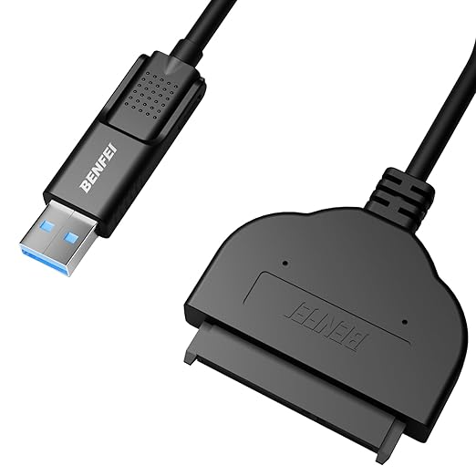

# Préparation du matériel

## Matériel nécessaire

### Composants requis

!!!WARNING "Attention : Évitez les Cartes SD pour le Stockage Principal"
    L'utilisation d'une carte SD comme disque principal n'est pas recommandée pour ce type d'installation.
    Le système effectue de nombreuses écritures de journaux (logs), ce qui use très rapidement les cartes SD (nombre de cycles d'écriture limité) et peut entraîner des pannes du système.
    Il est fortement conseillé d'utiliser un SSD connecté en USB
    pour garantir la fiabilité et la longévité de votre serveur.

- [ ] **Raspberry Pi 4** (4 Go minimum recommandé)
    
    * [Acheter sur Amazon](https://www.amazon.fr/Raspberry-Pi-4595-modèles-Go/dp/B09TTNF8BT)
    * Modèle 4 Go ou 8 Go recommandé

- [ ] **SSD SATA** (minimum 64 Go recommandé)
    * [Lexar SSD SATA 240 Go](https://www.amazon.fr/Lexar-Lecture-Ordinateur-Portable-LNQ100X240G-RNNNG/dp/B0BJKPZGQK)
    * Un SSD améliore considérablement les performances par rapport à une carte SD

- [ ] **Adaptateur USB vers SATA**
    
    * [Adaptateur USB 3.0 vers SATA](https://www.amazon.fr/dp/B07F7WDZGT)

- [ ] **Alimentation** (5V, 3A minimum)
- [ ] **Câble Ethernet**
- [ ] **Carte microSD** (optionnelle, pour l'installation initiale)

## Préparation du SSD

### Étape 1 : Brancher le SSD à l'adaptateur USB


1. Connecter le SSD SATA à l'adaptateur USB-SATA
   - Le connecteur SATA de l'adaptateur se connecte directement sur le SSD
   - Assurez-vous que la connexion est bien enfoncée
2. Brancher l'adaptateur à votre ordinateur via USB
   - Utilisez un port USB 3.0 (bleu) si disponible pour de meilleures performances

### Étape 2 : Vérifier la détection

Sur Windows :
- Ouvrir le Gestionnaire de disques
- Vérifier que le SSD est détecté

Sur Linux/Mac :
```bash
lsblk  # Linux
diskutil list  # Mac
```

## Logiciel nécessaire

### Raspberry Pi Imager

Télécharger et installer **Raspberry Pi Imager** depuis le site officiel :

- **Site officiel** : [https://www.raspberrypi.com/software/](https://www.raspberrypi.com/software/)
- **Documentation française** : Disponible sur le site officiel

#### Installation

**Windows :**
- Télécharger l'installateur `.exe`
- Exécuter l'installateur et suivre les instructions

**macOS :**
- Télécharger le fichier `.dmg`
- Ouvrir le fichier et glisser l'application dans Applications

**Linux :**
```bash
# Ubuntu/Debian
sudo apt update
sudo apt install rpi-imager

# Ou télécharger depuis le site officiel
```

## Vérification avant installation

Avant de procéder à l'installation de l'OS, vérifier :

- [ ] SSD correctement connecté et détecté
- [ ] Raspberry Pi Imager installé
- [ ] Alimentation Raspberry Pi disponible
- [ ] Câble Ethernet disponible
- [ ] Carte microSD (si nécessaire pour l'installation initiale)

---
[:material-arrow-right-circle: **Étape suivante : Installation de l'OS**](os-installation.md){ .md-button .md-button--primary }

