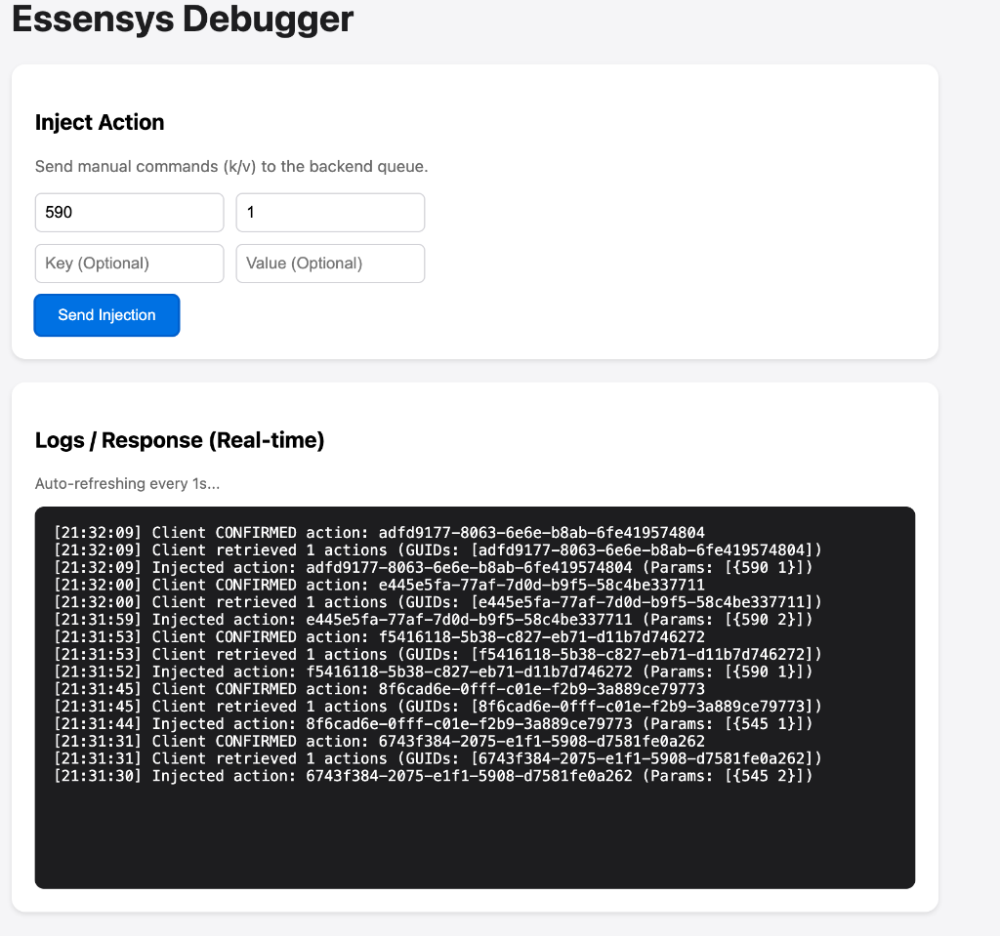

# Interface de Débogage

L'interface de débogage (`/debug`) est un outil intégré au backend pour tester les communications avec les clients Essensys et diagnostiquer les problèmes de scénarios.

## Accès

L'interface est accessible à l'adresse suivante :
`http://mon.essensys.fr/debug`

## Diagnostic MCP (Ops)

En complément de `/debug`, le serveur MCP fournit des outils d'exploitation pour accélérer le diagnostic et la remédiation.

### Outils recommandés

- `list_service_status` : état `active/enabled` des services clés.
- `read_service_logs` : lecture `journalctl` d'un service.
- `restart_service` : redémarrage ciblé d'un service autorisé.
- `get_port_diagnostics` : vérifie les ports clés (`80`, `443`, `7070`, `8083`, `6379`).
- `get_system_metrics` : uptime, mémoire, disque, interfaces, clients.
- `run_self_diagnostic` : état global + recommandations, avec `auto_repair=true` possible.

### Workflow conseillé (MCP)

1. Exécuter `run_self_diagnostic`.
2. Lire `recommendations`.
3. Si nécessaire, relancer avec `auto_repair=true`.
4. Vérifier avec `list_service_status` puis `read_service_logs` sur les services encore KO.

## Fonctionnalités



### 1. Injection d'Actions (Inject Action)
Cette section permet d'envoyer manuellement des commandes au client (injecter des actions dans la file d'attente du backend).

*   **Key (Clé)** : L'indice de la variable à modifier (ex: `590` pour déclencher un scénario, `619` pour une lumière).
*   **Value (Valeur)** : La valeur à affecter.

**Exemple "Allumer Couloir" :**
*   Key: `619`
*   Value: `4`

**Exemple "Déclencher Scénario 2 (Je sors)" :**
*   Key: `590`
*   Value: `1` (Confirmation)

### 2. Logs Temps Réel (Logs / Response)
Cette section affiche les traces de communication backend/client en temps réel.

*   **Injected action** : Indique que votre commande manuelle a été reçue par le backend et mise en file d'attente (avec un GUID unique).
*   **Client retrieved ... actions** : Indique que le client (le boîtier Essensys) a fait une requête `GET /api/myactions` et a récupéré la commande. C'est la preuve que le "polling" fonctionne.
*   **Client CONFIRMED action** : Indique que le client a envoyé une requête `POST /api/done/{guid}` pour confirmer qu'il a bien reçu et traité l'action.

## Diagnostic

*   **Si vous voyez "Injected" mais jamais "Retrieved"** : Le client n'est probablement pas connecté ou ne poll pas l'API correctement. Vérifiez la connectivité réseau du boîtier.
*   **Si vous voyez "Retrieved" mais jamais "Confirmed"** : Le client reçoit la commande mais échoue à la traiter (bug firmware) ou à envoyer la confirmation.
## Référence des Commandes (Basé sur Scenario 1)

Voici la liste des constantes pour l'injection manuelle, basées sur les indices du **Scenario 1** (Zone de test recommandée).

**Pour exécuter une commande :**
1.  Injectez les valeurs dans les clés ci-dessous (ex: `611:1` pour allumer entrée).
2.  (Optionnel) Si nécessaire, déclenchez le scénario 1 en injectant `590:1` (Index `Scenario`).

### Éclairage - ALLUMER

| Constante | Clé | Valeur | Description |
| :--- | :--- | :--- | :--- |
| **Sce_Allumer_PDV_LSB** | **611** | `1` | Lampe Entrée |
| | | `2` | Lampe Salon 1 |
| | | `4` | Lampe Salon 2 |
| | | `8` | Lampe Dressing 1 |
| | | `16` | Lampe Dressing 2 |
| **Sce_Allumer_PDV_MSB** | **612** | `32` | Variateur Bureau |
| | | `64` | Variateur Salle à Manger |
| | | `128` | Variateur Salon |
| **Sce_Allumer_CHB_LSB** | **613** | `1` | Lampe Escalier |
| | | `2` | Lampe Grande Chambre 1 |
| | | `4` | Lampe Grande Chambre 2 |
| | | `8` | Lampe Petite Chambre 1 (1) |
| | | `16` | Lampe Petite Chambre 1 (2) |
| | | `32` | Lampe Petite Chambre 2 |
| | | `64` | Lampe Petite Chambre 3 |
| **Sce_Allumer_CHB_MSB** | **614** | `16` | Variateur Petite Chambre 3 |
| | | `32` | Variateur Petite Chambre 2 |
| | | `64` | Variateur Petite Chambre 1 |
| | | `128` | Variateur Grande Chambre |
| **Sce_Allumer_PDE_LSB** | **615** | `1` | Lampe Cuisine 1 |
| | | `2` | Lampe Cuisine 2 |
| | | `4` | Lampe SDB 1 |
| | | `8` | Lampe SDB 2 (1) |
| | | `16` | Lampe SDB 2 (2) |
| | | `32` | Lampe WC 1 |
| | | `64` | Lampe WC 2 |
| | | `128` | Lampe Service |
| **Sce_Allumer_PDE_MSB** | **616** | `1` | Lampe Dégagement 1 |
| | | `2` | Lampe Dégagement 2 |
| | | `4` | Lampe Terrasse |
| | | `8` | Lampe Annexe 1 |
| | | `16` | Lampe Annexe 2 |
| | | `128` | Variateur SDB 1 |

### Éclairage - ÉTEINDRE

| Constante | Clé | Valeur | Description |
| :--- | :--- | :--- | :--- |
| **Sc_Eteindre_PDV_LSB** | **605** | `1...255` | Entrée, Salon, Dressing (Mêmes bits que Allumer) |
| **Sc_Eteindre_PDV_MSB** | **606** | `32...128` | Variateurs PDV |
| **Sc_Eteindre_CHB_LSB** | **607** | `1...64` | Lampes Chambres |
| **Sc_Eteindre_CHB_MSB** | **608** | `16...128` | Variateurs Chambres |
| **Sce_Eteindre_PDE_LSB** | **609** | `1...128` | Lampes Pièces d'Eau |
| **Sce_Eteindre_PDE_MSB** | **610** | `1...128` | Lampes/Var Pièces d'Eau |

### Volets & Stores - OUVRIR

| Constante | Clé | Valeur | Description |
| :--- | :--- | :--- | :--- |
| **Sce_OuvrirVolets_PDV** | **617** | `1` | Volet Salon 1 |
| | | `2` | Volet Salon 2 |
| | | `4` | Volet Salon 3 |
| | | `8` | Volet SAM 1 |
| | | `16` | Volet SAM 2 |
| | | `32` | Volet Bureau |
| **Sce_OuvrirVolets_CHB** | **618** | `1` | Volet Grande Chambre 1 |
| | | `2` | Volet Grande Chambre 2 |
| | | `4` | Volet Petite Chambre 1 |
| | | `8` | Volet Petite Chambre 2 |
| | | `16` | Volet Petite Chambre 3 |
| **Sce_OuvrirVolets_PDE** | **619** | `1` | Volet Cuisine 1 |
| | | `2` | Volet Cuisine 2 |
| | | `4` | Volet SDB 1 |
| | | `8` | Remonter Store Terrasse |

### Volets & Stores - FERMER

| Constante | Clé | Valeur | Description |
| :--- | :--- | :--- | :--- |
| **Sce_FermerVolets_PDV** | **620** | `1...32` | Volets PDV (Mêmes bits que Ouvrir) |
| **Sce_FermerVolets_CHB** | **621** | `1...16` | Volets Chambres |
| **Sce_FermerVolets_PDE** | **622** | `1...8` | Volets PDE / Sortir Store |

### Scénarios & Sécurité

| Constante | Clé | Valeur | Description |
| :--- | :--- | :--- | :--- |
| **Sc_Alarme_ON** | **593** | `1` | Mettre l'alarme |
| | | `2` | Enlever l'alarme |
| **Sce_Securite** | **623** | `1` | Couper prises sécurité |
| | | `2` | Remettre prises sécurité |
| **Sce_Machines** | **624** | `1` | Couper machines à laver |
| | | `2` | Remettre machines à laver |
| **Scenario** | **590** | `1...8` | **DÉCLENCHER UN SCÉNARIO** (1=Scen1) |

## Description des Scénarios (Table de Vérité)

Voici le comportement par défaut des scénarios (basé sur `table_ref.txt` et `TableEchange.h`).
Pour déclencher un scénario, injectez son numéro (1-8) dans la clé **590**.

| # | Nom | Base | Comportement par défaut |
| :--- | :--- | :--- | :--- |
| **1** | **Réservé Internet** | 592 | *Vide par défaut*. Utilisé pour les commandes manuelles via le debug (Zone de test). |
| **2** | **Je sors** | 633 | **Alarme** : Active (ON).<br>**Volets** : Ferme TOUT.<br>**Sécurité** : Coupe les prises.<br>**Confirmation** : Requise sur l'écran. |
| **3** | **Je pars en vacances** | 674 | **Alarme** : Active (ON).<br>**Volets** : Ferme TOUT.<br>**Chauffage** : Force HORS GEL (toutes zones).<br>**Eau/Machines** : Coupe l'eau (Securite) et les machines.<br>**Cumulus** : OFF. |
| **4** | **Je rentre** | 715 | **Alarme** : Désactive (OFF).<br>**Volets** : Ouvre TOUT.<br>**Sécurité** : Rétablit les prises.<br>**Chauffage** : Reprend le dernier mode mémorisé.<br>**Machines** : Rétablit l'alimentation. |
| **5** | **Je vais me coucher** | 756 | **Alarme** : Active (ON).<br>**Volets** : Ferme TOUT.<br>**Réveil** : Arme la fonction réveil.<br>**Sécurité** : Coupe les prises.<br>**Chauffage** : Continue le fonctionnement actuel. |
| **6** | **Je me lève** | 797 | **Alarme** : Désactive (OFF).<br>**Volets** : Ouvre TOUT.<br>**Sécurité** : Rétablit les prises.<br>**Réveil** : Désactivé. |
| **7** | **Personnalisé 1** | 838 | *Vide par défaut*. Configurable par l'utilisateur. |
| **8** | **Personnalisé 2** | 879 | *Vide par défaut*. Configurable par l'utilisateur. |

## Personnalisation (Scénarios 7 et 8)

D'après le code C (`TableEchange.h`), tous les scénarios partagent la même structure de données (définie par `enum enumScenario`).
Pour configurer un scénario "Personnalisé", il suffit d'écrire les valeurs souhaitées aux adresses mémoire correspondantes.

**Formule :** `Clé = Base_Scénario + Offset_Fonction`

### Bases des Scénarios
*   **Scénario 7** : `838`
*   **Scénario 8** : `879`

### Offsets des Fonctions (à ajouter à la Base)

| Fonction | Offset | Description |
| :--- | :--- | :--- |
| **Alarme** | `+1` | `1`=Activer, `2`=Désactiver |
| **Éteindre PDV (LSB)** | `+13` | Voir tableau "Éclairage" pour les valeurs (bits) |
| **Allumer PDV (LSB)** | `+19` | Voir tableau "Éclairage" pour les valeurs |
| **Ouvrir Volets PDV** | `+25` | Voir tableau "Volets - Ouvrir" |
| **Fermer Volets PDV** | `+28` | Voir tableau "Volets - Fermer" |
| **Sécurité** | `+31` | `1`=Couper, `2`=Rétablir |

*(Note : Les offsets continuent séquentiellement pour MSB, CHB, PDE... Voir `TableEchange.h` pour la liste complète : +19=Allumer PDV LSB, +20=PDV MSB, +21=CHB LSB...)*

### Exemple Concret
**Objectif :** Configurer le **Scénario 7** pour qu'il **allume la lampe de l'Entrée** (`Valeur 1`).

1.  **Base Scénario 7** = `838`
2.  **Offset Allumer PDV LSB** = `+19`
3.  **Clé à injecter** = 838 + 19 = **857**
4.  **Valeur** = `1` (Entrée)

**Commande à injecter :** `857:1`
Ensuite, déclencher le scénario 7 en injectant `590:7`.

### Exemples de Configuration pour le Scénario 7 (Base 838)

Voici deux exemples complets pour illustrer la logique.

#### Exemple A : "Soirée TV" (Fermer Salon + Lumière Tamisée)
**Objectif :**
1.  Fermer les 3 volets du Salon.
2.  Allumer le variateur du Salon.
3.  Éteindre les lumières de la Cuisine (pour éviter les reflets).

**Calculs & Injections :**

| Action | Offset | Clé (838 + Offset) | Valeur (Bitmask) | Description |
| :--- | :--- | :--- | :--- | :--- |
| **Fermer Volets Salon** | `+28` | **866** | `7` | `1` (Volet 1) + `2` (Volet 2) + `4` (Volet 3) = **7** |
| **Allumer Var. Salon** | `+20` | **858** | `128` | `128` (Variateur Salon) cf. Table Allumer MSB |
| **Eteindre Cuisine** | `+17` | **855** | `3` | `1` (Cuisine 1) + `2` (Cuisine 2) = **3** |

**Résumé :** Injectez `866:7`, `858:128`, `855:3` -> Puis lancez `590:7`.

#### Exemple B : "Sécurité Totale" (Départ Vacances Personnalisé)
**Objectif :**
1.  Mettre l'alarme.
2.  Fermer TOUS les volets de la maison (PDV, CHB, PDE).
3.  Couper l'arrivée d'eau (Sécurité).

**Calculs & Injections :**

| Action | Offset | Clé (838 + Offset) | Valeur | Description |
| :--- | :--- | :--- | :--- | :--- |
| **Alarme ON** | `+1` | **839** | `1` | `1` = Mettre l'alarme |
| **Fermer Volets PDV** | `+28` | **866** | `255` | `255` = Tous les bits à 1 (Salon, SAM, Bureau...) |
| **Fermer Volets CHB** | `+29` | **867** | `255` | `255` = Toutes les chambres |
| **Fermer Volets PDE** | `+30` | **868** | `255` | `255` = Cuisine, SDB, Store |
| **Couper Eau** | `+31` | **869** | `1` | `1` = Couper prises/eau (Sécurité) |

**Résumé :** Injectez `839:1`, `866:255`, `867:255`, `868:255`, `869:1` -> Puis lancez `590:7`.

### Table Complète des Offsets (Programmation C)

Utilisez ce tableau pour calculer n'importe quelle clé de configuration.
**Clé Finale = Base Scénario + Offset**

*Exemple de calcul pour la colonne "Ex: Clé Scén 7" : Base 838 + Offset.*

| Offset | Ex: Clé Scén 7 | Variable C | Fonction / Description | Valeurs (Bitmask) |
| :--- | :--- | :--- | :--- | :--- |
| **+0** | **838** | `Scenario_Confirme_Scenario` | Demande Confirmation | `1`=Oui (Géré par écran) |
| **+1** | **839** | `Scenario_Alarme_ON` | Activation Alarme | `1`=ON, `2`=OFF |
| **+2** | **840** | `AlarmeConfig_Code` | Config : Code Requis | `1`=Oui, `0`=Non |
| **+3** | **841** | `AlarmeConfig_Detect1` | Config : Détecteur Présence 1 | `1`=Utilisé, `0`=Désactivé |
| **+4** | **842** | `AlarmeConfig_Detect2` | Config : Détecteur Présence 2 | `1`=Utilisé, `0`=Désactivé |
| **+5** | **843** | `AlarmeConfig_DetectOuv` | Config : Détecteur Ouverture | `1`=Utilisé, `0`=Désactivé |
| **+6** | **844** | `AlarmeConfig_Detect1SurVoie` | Config : Présence 1 sur Voie | `1`=Oui, `0`=Non |
| **+7** | **845** | `AlarmeConfig_Detect2SurVoie` | Config : Présence 2 sur Voie | `1`=Oui, `0`=Non |
| **+8** | **846** | `AlarmeConfig_DetectOuvSurVoie`| Config : Ouverture sur Voie | `1`=Oui, `0`=Non |
| **+9** | **847** | `AlarmeConfig_SireneInt` | Config : Sirène Intérieure | `1`=Activée, `0`=Non |
| **+10** | **848** | `AlarmeConfig_SireneExt` | Config : Sirène Extérieure | `1`=Activée, `0`=Non |
| **+11** | **849** | `AlarmeConfig_BloqueVolets` | Config : Bloquer Volets si Alarme| `1`=Oui, `0`=Non |
| **+12** | **850** | `AlarmeConfig_ForcerEclairage` | Config : Forcer Lumières si Alarme| `1`=Oui, `0`=Non |
| **+13** | **851** | `Scenario_Eteindre_PDV_LSB` | **Éteindre** PDV (Lampes) | Bits 0-7 (Entrée, Salon...) |
| **+14** | **852** | `Scenario_Eteindre_PDV_MSB` | **Éteindre** PDV (Variateurs) | Bits 5-7 (Var Salon/Bureau...) |
| **+15** | **853** | `Scenario_Eteindre_CHB_LSB` | **Éteindre** CHB (Lampes) | Bits 0-6 (Chambres...) |
| **+16** | **854** | `Scenario_Eteindre_CHB_MSB` | **Éteindre** CHB (Variateurs) | Bits 4-7 (Var Chambres...) |
| **+17** | **855** | `Scenario_Eteindre_PDE_LSB` | **Éteindre** PDE (Lampes) | Bits 0-7 (Cuis., SDB, WC...) |
| **+18** | **856** | `Scenario_Eteindre_PDE_MSB` | **Éteindre** PDE (Lampes/Var) | Bits 0-4 + 7 |
| **+19** | **857** | `Scenario_Allumer_PDV_LSB` | **Allumer** PDV (Lampes) | Bits 0-7 (Entrée, Salon...) |
| **+20** | **858** | `Scenario_Allumer_PDV_MSB` | **Allumer** PDV (Variateurs) | Bits 5-7 (Var Salon/Bureau...) |
| **+21** | **859** | `Scenario_Allumer_CHB_LSB` | **Allumer** CHB (Lampes) | Bits 0-6 (Chambres...) |
| **+22** | **860** | `Scenario_Allumer_CHB_MSB` | **Allumer** CHB (Variateurs) | Bits 4-7 (Var Chambres...) |
| **+23** | **861** | `Scenario_Allumer_PDE_LSB` | **Allumer** PDE (Lampes) | Bits 0-7 (Cuis., SDB, WC...) |
| **+24** | **862** | `Scenario_Allumer_PDE_MSB` | **Allumer** PDE (Lampes/Var) | Bits 0-4 + 7 |
| **+25** | **863** | `Scenario_OuvrirVolets_PDV` | **Ouvrir** Volets PDV | Bits 0-5 (Salon, SAM, Bur.) |
| **+26** | **864** | `Scenario_OuvrirVolets_CHB` | **Ouvrir** Volets CHB | Bits 0-4 (Chambres) |
| **+27** | **865** | `Scenario_OuvrirVolets_PDE` | **Ouvrir** Volets PDE | Bits 0-3 (Cuis., SDB, Store) |
| **+28** | **866** | `Scenario_FermerVolets_PDV` | **Fermer** Volets PDV | Bits 0-5 (Salon, SAM, Bur.) |
| **+29** | **867** | `Scenario_FermerVolets_CHB` | **Fermer** Volets CHB | Bits 0-4 (Chambres) |
| **+30** | **868** | `Scenario_FermerVolets_PDE` | **Fermer** Volets PDE | Bits 0-3 (Cuis., SDB, Store) |
| **+31** | **869** | `Scenario_Securite` | Prises Commandées | `1`=Couper, `2`=Rétablir |
| **+32** | **870** | `Scenario_Machines` | Machines à Laver | `1`=Couper, `2`=Rétablir |
| **+33** | **871** | `Scenario_Chauf_zj` | Chauffage Jour | `0x00...` |
| **+34** | **872** | `Scenario_Chauf_zn` | Chauffage Nuit | Idem |
| **+35** | **873** | `Scenario_Chauf_zsb1` | Chauffage SDB 1 | Idem |
| **+36** | **874** | `Scenario_Chauf_zsb2` | Chauffage SDB 2 | Idem |
| **+37** | **875** | `Scenario_Cumulus` | Cumulus | `0`=Auto, `1`=HC, `2`=OFF |
| **+38** | **876** | `Scenario_Reveil_Reglage` | Réveil : Procédure Réglage | `1`=Lancer réglage |
| **+39** | **877** | `Scenario_Reveil_ON` | Réveil : Activation | `1`=Armer, `2`=Désactiver |
| **+40** | **878** | `Scenario_Efface` | Effacer Scénario | `1`=Reset Paramètres |

## Configuration des Temps (Volets & Lampes)

Vous pouvez régler la durée de course des volets ou le temps d'extinction automatique des lampes.

### Temps de Course des Volets (en Secondes)
*Valeur : 1 à 255 secondes.*

| Zone | Clé de Base | Description | Détail des Indices |
| :--- | :--- | :--- | :--- |
| **Volets PDV** | **566** | Salon, SAM, Bureau | `566`=Volet 1, `567`=Volet 2 ... `573`=Volet 8 |
| **Volets CHB** | **574** | Chambres | `574`=Volet 1 ... `581`=Volet 8 |
| **Volets PDE** | **582** | Cuis., SDB, Store | `582`=Volet 1 ... `589`=Volet 8 |

**Exemple :** Régler le Volet 1 du Salon (Index 0 de PDV) à 20 secondes.
*   Clé : `566`
*   Valeur : `20`

### Temps d'Extinction Automatique des Lampes (en Minutes)
*Valeur : 1 à 255 minutes (0 = Pas d'extinction).*

| Zone | Clé de Base | Description | Détail des Indices Utiles |
| :--- | :--- | :--- | :--- |
| **Lampes PDV** | **518** | Entrée, Salon... | *Non documenté dans le code C (marqué inutilisé)* |
| **Lampes CHB** | **534** | Chambres | *Non documenté dans le code C (marqué inutilisé)* |
| **Lampes PDE** | **550** | Pièces d'Eau | **555** = WC 1<br>**556** = WC 2<br>**557** = Service |

**Exemple :** Éteindre la lumière du **WC 1** automatiquement après **5 minutes**.
*   Clé : `555` (550 + 5)
*   Valeur : `5`

## Configuration des Variateurs (Type de Sortie)

Vous pouvez configurer le type de charge pilotée par les sorties variateurs.

**Valeurs possibles :**
*   `0` : **TOR avec Rampe** (Allumage/Extinction progressif type halogène)
*   `1` : **Gradateur** (Dimmer variable)
*   `2` : **TOR Sec** (Sans rampe, pour LED non dimmable ou Relais)

| Zone | Clé de Base | Détail des Indices (Sorties Câblées) |
| :--- | :--- | :--- |
| **Variateurs PDV** | **494** | **494** = Salon<br>**495** = Salle à Manger<br>**496** = Bureau |
| **Variateurs CHB** | **502** | **502** = Grande Chambre<br>**503** = Pt. Chambre 1<br>**504** = Pt. Chambre 2<br>**505** = Pt. Chambre 3 |
| **Variateurs PDE** | **510** | **510** = Salle de Bain 1 |

**Exemple :** Configurer la **Salle à Manger** (PDV + 1) en mode **Gradateur**.
*   Clé : `495`
*   Valeur : `1`

## Configuration de l'Arrosage

Vous pouvez piloter le système d'arrosage automatique.

### Mode de Fonctionnement (`Arrose_Mode`)
**Clé :** `363`

| Valeur | Description |
| :--- | :--- |
| **0** | **OFF** : Pas d'arrosage |
| **1 à 254** | **Marche Forcée** : Durée en minutes |
| **255** | **Automatique** : Selon planning horaire |

### Détecteur de Pluie (`Arrose_Detect`)
**Clé :** `406`

| Valeur | Description |
| :--- | :--- |
| **0** | **Inactif** : Le détecteur est ignoré (Arrose même s'il pleut) |
| **1** | **Actif** : S'il pleut, l'arrosage est coupé |

**Exemple :** Forcer l'arrosage pendant **30 minutes**.
*   Clé : `363`
*   Valeur : `30`

## Configuration Fin de Vacances (Retour)

Paramétrez la date de retour et le mode de chauffage à appliquer à ce moment-là.

### Date et Heure de Fin (`VacanceFin`)

| Clé | Description | Valeur |
| :--- | :--- | :--- |
| **354** | Heure | 0-23 |
| **355** | Minute | 0-59 |
| **356** | Jour | 1-31 |
| **357** | Mois | 1-12 |
| **358** | Année | 0-99 (ex: 25 pour 2025) |

### Chauffage au Retour (`VacanceFin_Force`)

Définit le mode de chauffage qui s'enclenchera à la date définie ci-dessus.

| Clé | Zone |
| :--- | :--- |
| **359** | Zone Jour (zj) |
| **360** | Zone Nuit (zn) |
| **361** | SDB 1 (zsb1) |
| **362** | SDB 2 (zsb2) |

**Valeurs (Bitmask) :**
La valeur combine la consigne (Bits 0-3) et le mode (Bits 4-5).
*   **Consigne (b0-b3)** : `0`=OFF, `1`=Confort, `2`=Eco, `3`=Eco+, `4`=Eco++, `5`=Hors Gel.
*   **Mode (b4-b5)** : `0`=Auto, `1`=Forcé, `2`=Anticipé.
*   **Reprise (b7)** : `128` (0x80) = "Continuer le fonctionnement actuel" (Ignore le reste).

**Exemples de Valeurs :**
*   `1` (0x01) : Auto + Confort
*   `2` (0x02) : Auto + Eco
*   `5` (0x05) : Auto + Hors Gel
*   `17` (0x11) : Forcé + Confort (16 + 1)
*   `21` (0x15) : Forcé + Hors Gel (16 + 5)
*   `128` (0x80) : Ne rien changer (Continuer)

## Versions Système

Informations sur les versions logicielles installées.

| Clé | Variable C | Description |
| :--- | :--- | :--- |
| **0** | `Version_SoftBP_Embedded` (V_BP) | Version du micro-logiciel (Embedded) |
| **1** | `Version_SoftBP_Web` (V_SoftBP) | Version Web (Publication serveur) |
| **2** | `Version_SoftIHM_Majeur` (V_IHM) | Version Majeure IHM |
| **3** | `Version_SoftIHM_Mineur` (V_SoftIHM)| Version Mineure IHM |
| **4** | `Version_TableEchange` | Version de la table d'échange |

## État du Système (Lecture Seule)

Ces variables indiquent l'état global et les défauts en cours.

### Statut Global (`Status`)
**Clé :** `10`

| Bit | Valeur | Signification |
| :--- | :--- | :--- |
| **b0** | `1` | Heures Creuses en cours |
| **b1** | `2` | Délestage en cours |
| **b2** | `4` | Mode Secouru (Batterie) |

### Alertes (`Alerte`)
**Clé :** `11`

| Bit | Valeur | Signification |
| :--- | :--- | :--- |
| **b0** | `1` | Déclenchement Alarme (Intrusion) |
| **b1** | `2` | Alerte Fuite d'Eau (Lave-Linge) |
| **b2** | `4` | Alerte Fuite d'Eau (Lave-Vaisselle) |

### Informations Techniques (`Information`)
**Clé :** `12`

| Bit | Valeur | Signification |
| :--- | :--- | :--- |
| **b0** | `1` | Défaut Com. Compteur ERDF |
| **b1** | `2` | Défaut Com. IHM (Ecran) |
| **b2** | `4` | Défaut Com. Bus CAN (PDV) |
| **b3** | `8` | Défaut Com. Bus CAN (CHB) |
| **b3** | `8` | Défaut Com. Bus CAN (CHB) |
| **b4** | `16` | Défaut Com. Bus CAN (PDE) |

## Configuration du Délestage

Permet d'activer ou désactiver la fonction de délestage (coupure automatique des gros consommateurs si dépassement puissance).

### Activation (`Delestage`)
**Clé :** `459`

| Valeur | Description |
| :--- | :--- |
| **0** | **Désactivé** : La fonction est inactive. |
| **1** | **Activé** : La fonction est active (Défaut). |

## Téléinformation Compteur ERDF

Données reçues du compteur électrique (Linky/Electronique) et paramètres de répartition.

### État Instantané & Option
**Plage :** `460` à `464`

| Clé | Variable | Description |
| :--- | :--- | :--- |
| **460** | `TeleInf_OPTARIF` | Option Tarifaire (Base, HC, EJP...) |
| **461** | `TeleInf_PTEC` | Période Tarifaire en cours |
| **462** | `TeleInf_ADPS` | Avertissement Dépassement Puissance |
| **463** | `TeleInf_PAPP_LSB` | Puissance Apparente (LSB) |
| **464** | `TeleInf_PAPP_MSB` | Puissance Apparente (MSB) |

### Compteurs de Consommation (Index)
Les compteurs sont sur 2 octets (LSB/MSB).

**Heures Pleines / Base (HPB) :** `465` à `476`
*   **465-466** : Global
*   **467-468** : Chauffage
*   **469-470** : Refroidissement
*   **471-472** : Eau Chaude
*   **473-474** : Prises
*   **475-476** : Autres

**Heures Creuses (HC) :** `477` à `488`
*   Même ordre que HPB (Global, Chauffage, Refroid., Eau Ch., Prises, Autres).

### Répartition Estimée (%)
Paramètres pour définir la répartition de la consommation "Autre" (calcul théorique).

| Clé | Variable | Usage |
| :--- | :--- | :--- |
| **489** | `TeleInf_Repartition_Chauffage` | Part Chauffage (%) |
| **490** | `TeleInf_Repartition_Refroid` | Part Refroidissement (%) |
| **491** | `TeleInf_Repartition_EauChaude` | Part Eau Chaude (%) |
| **492** | `TeleInf_Repartition_Prises` | Part Prises (%) |
| **492** | `TeleInf_Repartition_Prises` | Part Prises (%) |
| **493** | `TeleInf_Repartition_Autres` | Part Autres (%) |

### Note sur les Valeurs 16 bits (LSB / MSB)

Les compteurs et puissances sont stockés sur 2 octets (16 bits).
Pour simuler une valeur (ex: 500 VA), vous devez calculer les parties LSB (Poids faible) et MSB (Poids fort).

**Formules :**
*   **MSB** = `Valeur_Totale` / 256 (Division entière)
*   **LSB** = `Valeur_Totale` % 256 (Modulo / Reste)

**Exemple : Simuler une puissance de 500 VA**
1.  **Calcul MSB** : 500 / 256 = **1**
2.  **Calcul LSB** : 500 - (1 * 256) = 500 - 256 = **244**

**Injection :**
*   Clé **464** (MSB) : `1`
*   Clé **463** (LSB) : `244`

### Consommation Instantanée (PAPP)

C'est la variable la plus courante à surveiller ou simuler.

*   **Variables** : `TeleInf_PAPP_LSB` (**463**) et `TeleInf_PAPP_MSB` (**464**).
*   **Unité** : Volt-Ampère (VA). (≈ Watt).

**Lecture (Reconstitution de la valeur) :**
`Puissance_Totale = (Valeur_464 * 256) + Valeur_463`

**Exemple :** Si 464 vaut `2` et 463 vaut `10`.
`Puissance = (2 * 256) + 10 = 512 + 10 = 522 VA`

## Cycle de Confirmation & Retour d'État

Lorsque vous injectez une valeur (ex: `464:1` pour le MSB puissance), le client (la carte) procède en deux temps :

1.  **Confirmation (ACK)** :
    Le client reçoit l'ordre, l'exécute, et appelle `/api/done/{guid}`.
    *Réponse :* `201 Created`. (Cette étape confirme juste la réception, pas la valeur).

2.  **Mise à jour d'État (Sync)** :
    Le client renvoie régulièrement son état complet (ou ses changements) via `/api/mystatus`.
    C'est dans ce message JSON (champ `ek`) que le serveur reçoit la confirmation de la nouvelle valeur.

    ```json
    POST /api/mystatus
    {
      "version": "...",
      "ek": [
        { "k": 464, "v": "1" },
        { "k": 463, "v": "244" }
      ]
    }
    ```

## Entrées Physiques ( Boutons )

Indices pour l'état des entrées physiques (Boutons Poussoirs).

| Clé | Variable | Description |
| :--- | :--- | :--- |
| **920** | `EtatBP1` | État du Bouton Poussoir 1 (**Boîtier Principal**) |


