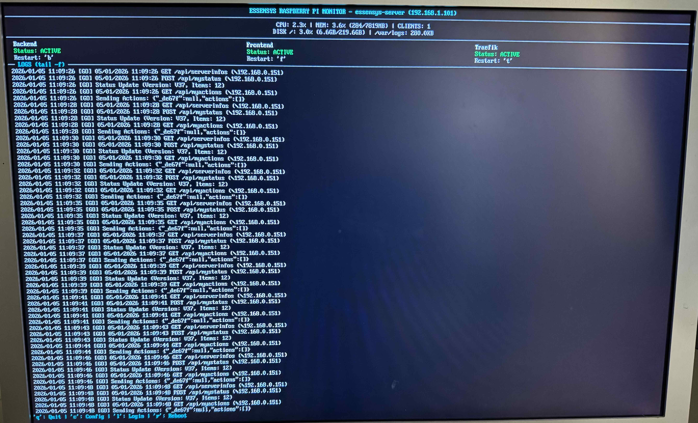

# Console de Monitoring (HMI)

Le système Essensys inclut désormais une interface de monitoring en console (HMI) développée en Python, permettant de suivre l'état du serveur directement depuis l'écran connecté au Raspberry Pi (ou via SSH).



## Fonctionnalités

Cette interface permet de :

*   **Visualiser l'état des services** :
    *   **Backend** (`essensys-backend`)
    *   **Frontend** (`nginx` - port interne 9090)
    *   **Traefik** (`traefik` - port 80/443)
    *   **AdGuard** (`AdGuardHome` - DNS port 53, UI port 3000)
*   **Contrôler les services** : Redémarrage facile des services via des raccourcis clavier.
*   **Monitoring système** :
    *   Utilisation CPU
    *   Utilisation Mémoire
    *   **Utilisation Disque** : Affichage de l'espace utilisé sur la racine (`/`) et `/var/logs`.
    *   **Nombre de clients** : Connexions actives sur les ports 80, 443, 7070.
*   **Réseau** : Affichage dynamique de toutes les interfaces réseau (IP et MAC), sans limitation à `eth0`/`wlan0`.
*   **Logs en temps réel** : Affichage simultané ou individuel des logs :
    *   **Backend** (`/var/logs/Essensys/backend/console.out.log`)
    *   **Traefik** (`/var/log/traefik/traefik-error.log`)
    *   **Nginx** (`/var/log/nginx/essensys-api-error.log`)

## Démarrage automatique

L'installation (`install.sh`) configure automatiquement le Raspberry Pi pour :
1.  Se connecter automatiquement sur `tty1` (écran physique) avec l'utilisateur `essensys`.
2.  Lancer le moniteur au démarrage de la session.

Si vous avez besoin de reconfigurer cela manuellement, vous pouvez utiliser le script :
```bash
sudo ./setup_monitor.sh
```

## Utilisation

### Vues (Logs)

| Touche | Action |
| :--- | :--- |
| **0** | **Vue d'ensemble** : Affiche les 3 logs (Backend, Traefik, Nginx) simultanément |
| **1** | **Backend** : Affiche uniquement les logs du Backend (Plein écran) |
| **2** | **Traefik** : Affiche uniquement les logs de Traefik (Plein écran) |
| **3** | **Nginx** : Affiche uniquement les logs Nginx (Plein écran) |

### Contrôle

| Touche | Action |
| :--- | :--- |
| **B** | Redémarrer le service **Backend** |
| **F** | Redémarrer le service **Frontend** (Nginx) |
| **T** | Redémarrer le service **Traefik** |
| **A** | Redémarrer le service **AdGuard Home** |
| **U** | **Update** (Forcer le rafraîchissement des services) |
| **R** | **Reboot** (Redémarrer le Raspberry Pi) |
| **C** | **Config** (Lancer `raspi-config`) |
| **L** | **Login** (Quitter et se connecter au shell) |
| **Q** | Quitter le moniteur |

## Dépannage

Si le moniteur ne se lance pas :
1.  Vérifiez que vous êtes sur `tty1` (écran physique) ou lancez-le manuellement : `sudo /opt/essensys/monitor.py`
2.  Assurez-vous que l'utilisateur a les droits `sudo` sans mot de passe pour le script (configuré par `setup_monitor.sh`).
