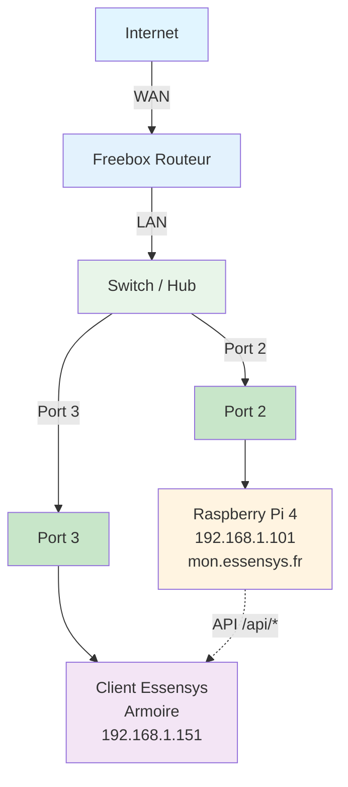

# Configuration Freebox

Configuration du NAT/port forwarding sur Freebox.

## Schéma de connexion réseau

**Connexions :**
- **Port 2** : Raspberry Pi 4 (192.168.1.101)
- **Port 3** : Client Essensys / Armoire (192.168.1.151)
- Le client Essensys communique avec le Raspberry Pi via les API `/api/*`

!!!WARNING "L'adresse IP `192.168.1.101` utilisée dans cet exemple est fictive"
    Vous devez impérativement identifier l'adresse IP réelle de votre Raspberry Pi sur votre réseau local pour configurer les redirections de port correctement.

## NAT/Port Forwarding

### Via l'interface Freebox

1. Se connecter à l'interface Freebox (http://mafreebox.freebox.fr)
2. Aller dans **Paramètres de la Freebox** → **Gestion des ports**
3. Cliquer sur **Ajouter une redirection de port**
4. Configurer :

**Redirection 1 : Port 80**
- **Nom** : Essensys HTTP
- **Protocole** : TCP
- **Port externe** : 80
- **Port interne** : 80
- **IP interne** : 192.168.1.101
!!!WARNING "L'adresse IP `192.168.1.101` utilisée dans cet exemple est fictive"
    Vous devez impérativement identifier l'adresse IP réelle de votre Raspberry Pi sur votre réseau local pour configurer les redirections de port correctement.

**Redirection 2 : Port 443**
- **Nom** : Essensys HTTPS
- **Protocole** : TCP
- **Port externe** : 443
- **Port interne** : 443
- **IP interne** : 192.168.1.101
!!!WARNING "L'adresse IP `192.168.1.101` utilisée dans cet exemple est fictive"
    Vous devez impérativement identifier l'adresse IP réelle de votre Raspberry Pi sur votre réseau local pour configurer les redirections de port correctement.

## Configuration DNS local

### Via l'interface Freebox (DHCP)

Pour que la résolution `mon.essensys.fr` fonctionne sur tout le réseau :

1.  Se connecter à l'interface Freebox (http://mafreebox.freebox.fr) en mode **Avancé**.
2.  Aller dans **Paramètres de la Freebox** → **Réseau Local** → **Serveur DHCP** → **Configuration**.
3.  Dans le champ **Serveur DNS 1**, entrer l'IP du Raspberry Pi : `192.168.1.101`.
!!!WARNING "L'adresse IP `192.168.1.101` utilisée dans cet exemple est fictive"
    Vous devez impérativement identifier l'adresse IP réelle de votre Raspberry Pi sur votre réseau local pour configurer les redirections de port correctement.

4.  Laisser les autres vides ou mettre un DNS public en secours (attention, si le Pi est éteint, `mon.essensys.fr` ne marchera plus).
5.  Valider.
6.  Redémarrer les appareils clients (ou désactiver/réactiver leur WiFi) pour qu'ils prennent en compte le nouveau DNS.

## Vérification

Vérifier que les redirections sont actives dans l'interface Freebox.
