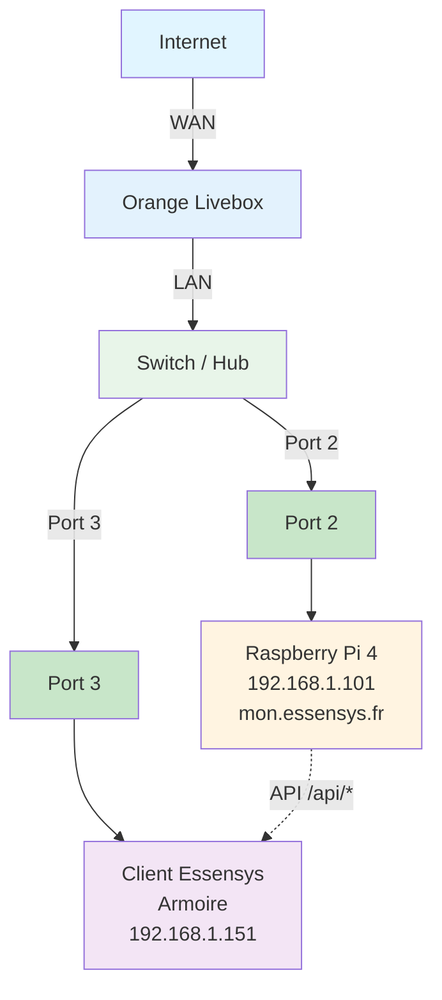

# Configuration Orange Livebox

Configuration du NAT/port forwarding sur Orange Livebox.

## Schéma de connexion réseau

!!!WARNING "L'adresse IP `192.168.1.101` utilisée dans cet exemple est fictive"
    Vous devez impérativement identifier l'adresse IP réelle de votre Raspberry Pi sur votre réseau local pour configurer les redirections de port correctement.

**Connexions :**
- **Port 2** : Raspberry Pi 4 (192.168.1.101)
- **Port 3** : Client Essensys / Armoire (192.168.1.151)
- Le client Essensys communique avec le Raspberry Pi via les API `/api/*`

!!!WARNING "L'adresse IP `192.168.1.101` utilisée dans cet exemple est fictive"
    Vous devez impérativement identifier l'adresse IP réelle de votre Raspberry Pi sur votre réseau local pour configurer les redirections de port correctement.

## NAT/Port Forwarding

### Via l'interface Livebox

1. Se connecter à l'interface Livebox (http://192.168.1.1)
!!!WARNING "L'adresse IP `192.168.1.101` utilisée dans cet exemple est fictive"
    Vous devez impérativement identifier l'adresse IP réelle de votre Raspberry Pi sur votre réseau local pour configurer les redirections de port correctement.
2. Aller dans **Paramètres avancés** → **NAT/PAT** ou **Redirection de ports**
3. Ajouter les règles :

**Règle 1 : Port 80**
- **Nom** : Essensys HTTP
- **Protocole** : TCP
- **Port externe** : 80
- **Port interne** : 80
- **IP interne** : 192.168.1.101
!!!WARNING "L'adresse IP `192.168.1.101` utilisée dans cet exemple est fictive"
    Vous devez impérativement identifier l'adresse IP réelle de votre Raspberry Pi sur votre réseau local pour configurer les redirections de port correctement.

**Règle 2 : Port 443**
- **Nom** : Essensys HTTPS
- **Protocole** : TCP
- **Port externe** : 443
- **Port interne** : 443
- **IP interne** : 192.168.1.101
!!!WARNING "L'adresse IP `192.168.1.101` utilisée dans cet exemple est fictive"
    Vous devez impérativement identifier l'adresse IP réelle de votre Raspberry Pi sur votre réseau local pour configurer les redirections de port correctement.

## Configuration DNS local

### Via l'interface Livebox

**Note importante** : La plupart des Livebox ne permettent **PAS** de modifier les serveurs DNS distribués par le DHCP.

**Solutions alternatives :**

1.  **Configuration manuelle sur les appareils** :
    *   Sur chaque appareil (PC, Smartphone), modifier les paramètres WiFi/Ethernet pour utiliser `192.168.1.101` comme serveur DNS.
!!!WARNING "L'adresse IP `192.168.1.101` utilisée dans cet exemple est fictive"
    Vous devez impérativement identifier l'adresse IP réelle de votre Raspberry Pi sur votre réseau local pour configurer les redirections de port correctement.
2.  **Désactiver le DHCP Livebox (Expert)** :
    *   Désactiver le DHCP de la Livebox.
    *   Activer le serveur DHCP intégré à **AdGuard Home** sur le Raspberry Pi (`http://mon.essensys.fr:3000` -> Paramètres -> Paramètres DHCP).
    *   *Attention : Si le Raspberry Pi s'arrête, plus aucun appareil n'aura d'adresse IP.*

## Vérification

Vérifier que les règles sont actives dans l'interface Livebox.
