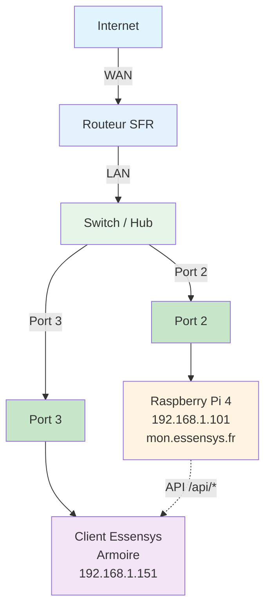

# Configuration SFR

Configuration du NAT/port forwarding sur routeur SFR.

## Schéma de connexion réseau

!!!WARNING "L'adresse IP `192.168.1.101` utilisée dans cet exemple est fictive"
    Vous devez impérativement identifier l'adresse IP réelle de votre Raspberry Pi sur votre réseau local pour configurer les redirections de port correctement.

**Connexions :**
- **Port 2** : Raspberry Pi 4 (192.168.1.101)
- **Port 3** : Client Essensys / Armoire (192.168.1.151)
- Le client Essensys communique avec le Raspberry Pi via les API `/api/*`

!!!WARNING "L'adresse IP `192.168.1.101` utilisée dans cet exemple est fictive"
    Vous devez impérativement identifier l'adresse IP réelle de votre Raspberry Pi sur votre réseau local pour configurer les redirections de port correctement.

## NAT/Port Forwarding

### Via l'interface SFR

1. Se connecter à l'interface du routeur SFR (généralement http://192.168.1.1)
2. Aller dans **Paramètres avancés** → **NAT/PAT** ou **Redirection de ports**
3. Ajouter les règles :

**Règle 1 : Port 80**
- **Nom** : Essensys HTTP
- **Protocole** : TCP
- **Port externe** : 80
- **Port interne** : 80
- **IP interne** : 192.168.1.101
!!!WARNING "L'adresse IP `192.168.1.101` utilisée dans cet exemple est fictive"
    Vous devez impérativement identifier l'adresse IP réelle de votre Raspberry Pi sur votre réseau local pour configurer les redirections de port correctement.
**Règle 2 : Port 443**
- **Nom** : Essensys HTTPS
- **Protocole** : TCP
- **Port externe** : 443
- **Port interne** : 443
- **IP interne** : 192.168.1.101
!!!WARNING "L'adresse IP `192.168.1.101` utilisée dans cet exemple est fictive"
    Vous devez impérativement identifier l'adresse IP réelle de votre Raspberry Pi sur votre réseau local pour configurer les redirections de port correctement.
## Configuration DNS local

### Via l'interface SFR (DHCP)

Pour que la résolution `mon.essensys.fr` fonctionne sur tout le réseau :

1.  Se connecter à l'interface de la Box SFR.
2.  Aller dans **Réseau** → **DHCP**.
3.  Repérer la section **Serveurs DNS**.
4.  Décocher "Automatique" si nécessaire.
5.  Dans **DNS Primaire**, entrer l'IP du Raspberry Pi : `192.168.1.101`.
6.  Valider.
7.  Redémarrer les appareils clients.
!!!WARNING "L'adresse IP `192.168.1.101` utilisée dans cet exemple est fictive"
    Vous devez impérativement identifier l'adresse IP réelle de votre Raspberry Pi sur votre réseau local pour configurer les redirections de port correctement.
## Vérification

Vérifier que les règles sont actives dans l'interface du routeur.
